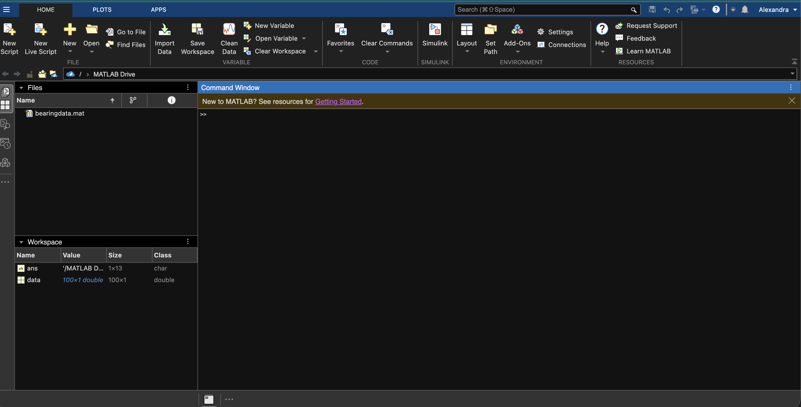
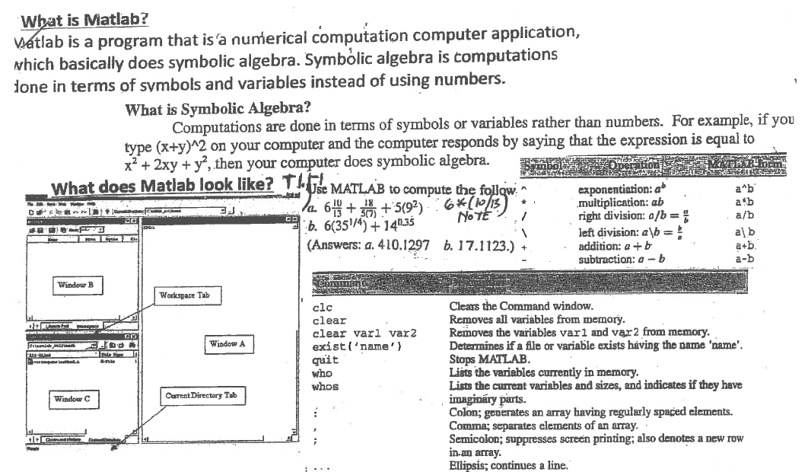

# MATLAB Lab Notebook

**Course:** ENGR60 — Programming & Problem-Solving in MATLAB
**Name:** Alexandra Yakovleva
**Started:** September 7 4, 2026

---

## Table of Contents

- [Lesson 1 Slides: About MATLAB](#lesson-1-slides-about-matlab)
- [Week 1 — Lab 1](#week-1--lab-1)

---

## Lesson 1 Slides: About MATLAB

*Source: Matlab_WVC-Lesson1-1 (Lecture 1 slides)*

### Textbooks

- **Required:** *An Engineer's Introduction to Programming with MATLAB 2019*, by Shawna Lockhart & Eric Tilleson
- **Optional:** *Getting Started with MATLAB 5*, by Rudra Pratap
- **Optional:** *Introduction to MATLAB 7 for Engineers*, by Palm

### Purchasing MATLAB Software

- MathWorks website: [mathworks.com](http://www.mathworks.com) — The only option now available for individual student purchase is the $119 per year, a Standard Student Suite, which bundles MATLAB, Simulink, and 11 add-on toolboxes into a single annual subscription-based service
- **Alternative:** Octave (free), available as a PC download or online.

### Outline

1. About MATLAB
2. Basics
3. Computing with MATLAB
4. Arrays and Matrices Operations

### About MATLAB

MATLAB is:
- A computer programming language
- A software environment for using that language effectively

**Two modes of operation:**
- **Interactive calculator mode** — commands typed and executed one at a time
- **Script mode** — execution of complete programs (script files)

Running MATLAB opens one or more windows. The primary one is the **MATLAB Desktop**, the main graphical user interface, which contains and manages all other MATLAB windows. Depending on configuration, some windows may or may not be visible — check the **View** menu.



**MATLAB Desktop windows:**

| Window | Purpose |
|---|---|
| **Command Window** | Primary place to interact with MATLAB; the `>>` prompt is where commands are issued (type `quit` or `exit` to close) |
| **Command History** | Running history of prior commands issued in the Command Window |
| **Workspace** | GUI for viewing, loading, and saving MATLAB variables |
| **Launch Pad** | Tree layout for accessing tools, demos, and documentation |
| **Current Directory** | GUI for directory and file manipulation |
| **Help** | GUI for finding and viewing online documentation |
| **Array Editor** | GUI for modifying the contents of MATLAB variables |
| **Editor/Debugger** | Text editor and debugger for MATLAB `.m` files |

### Basics: Basic Operations

| Symbol | Operation | MATLAB form |
|---|---|---|
| `^` | exponentiation: aᵇ | `a^b` |
| `*` | multiplication: ab | `a*b` |
| `/` | right division: a/b | `a/b` |
| `\` | left division: b/a | `a\b` |
| `+` | addition: a + b | `a+b` |
| `-` | subtraction: a − b | `a-b` |

**Examples:**
```matlab
>> 5^2
ans =
    25

>> cos(pi)
ans =
    -1
```

### Basics: Rules of Precedence

| Precedence | Operation |
|---|---|
| First | Parentheses, evaluated starting with the innermost pair |
| Second | Exponentiation, evaluated left to right |
| Third | Multiplication and division (equal precedence), left to right |
| Fourth | Addition and subtraction (equal precedence), left to right |

**Precedence examples:**
```
8 + 3 * 5 = 23            → (8 + (3 * 5))
4 ^ 2 – 12 – 8 / 4 * 2 = 0 → ((4^2) – 12 – ((8/4) * 2))
3 * 4 ^ 2 + 5 = 53         → ((3 * (4^2)) + 5)
27 ^ 1 / 3 + 32 ^ 0.2 = 11 → (((27^1) / 3) + (32^0.2))
```
*Text reference: page 10*

---

## Week 1 — Lab 1

*Source: Lab1-1 assignment notes*

Your first exercise using MATLAB begins with calculations.

**What is MATLAB?** A numerical computation computer application that basically performs symbolic algebra — computations done in terms of symbols and variables instead of pure numbers.

As shown in the slides, typing into the Command Window:
```matlab
>> 5^2
```
should return `25`.

Once comfortable with the basic operations from the slides, the lab moves on to computations and symbolic algebra in MATLAB (or Octave, if MATLAB isn't installed).



Useful commands to memorize (used frequently throughout the course):

| Command | Action |
|---|---|
| `clc` | Clears the Command Window |
| `clear` | Removes all variables from memory |
| `clear var1 var2` | Removes the variables `var1` and `var2` from memory |
| `exist('name')` | Determines if a file or variable named `'name'` exists |
| `quit` | Stops MATLAB |
| `who` | Lists variables currently in memory |
| `whos` | Lists variables, sizes, and whether they have imaginary parts |
| `:` | Colon — generates an array of regularly spaced elements |
| `,` | Comma — separates elements of an array |
| `;` | Semicolon — suppresses screen printing; also denotes a new row in an array |
| `...` | Ellipsis — continues a line |

### T1-1 — Use MATLAB to compute the following

**a.** 6(10/13) + 18/(5·7) + 5(9²)
```matlab
>> 6*(10/13) + 18/(5*7) + 5*(9^2)
ans =
   410.1297
```

**b.** 6(35^(1/4)) + 14^0.35
```matlab
>> 6*(35^(1/4)) + 14^0.35
ans =
   17.1123
```

---
