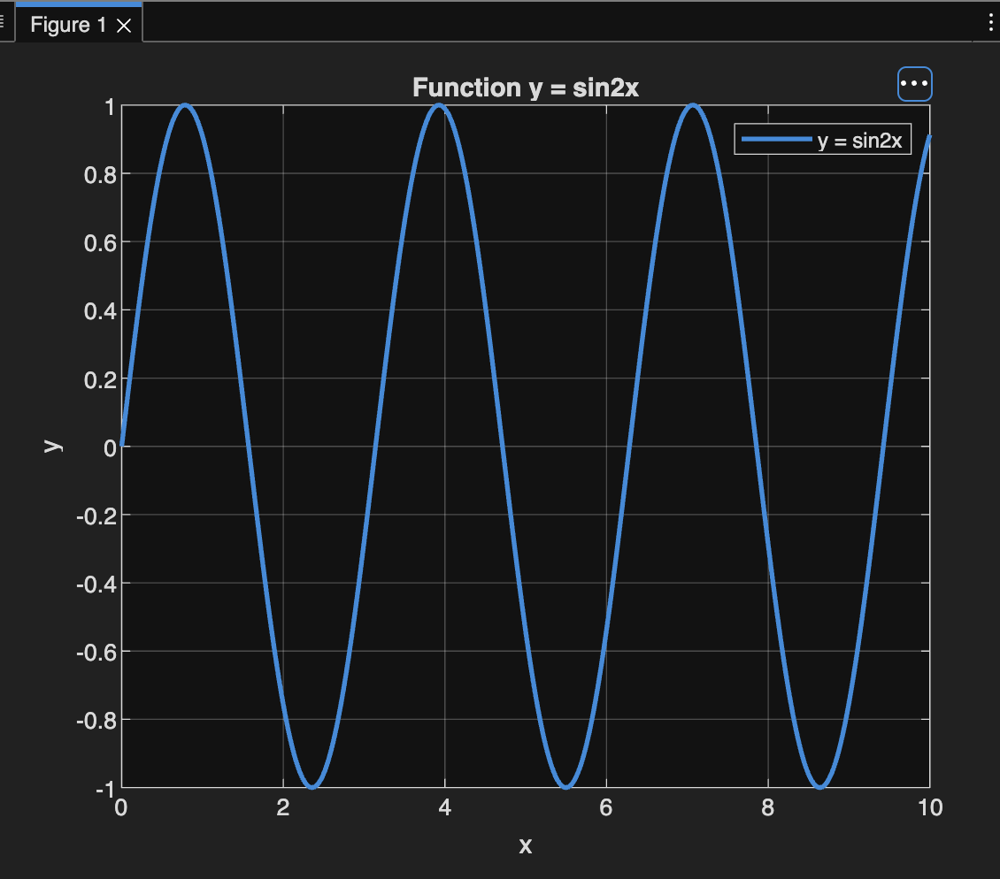
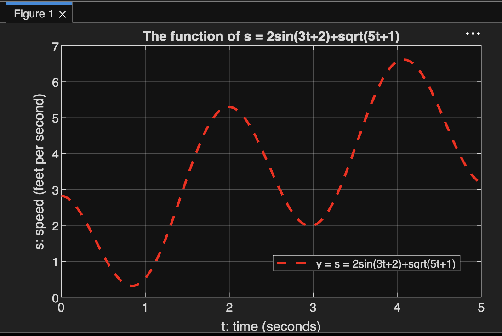
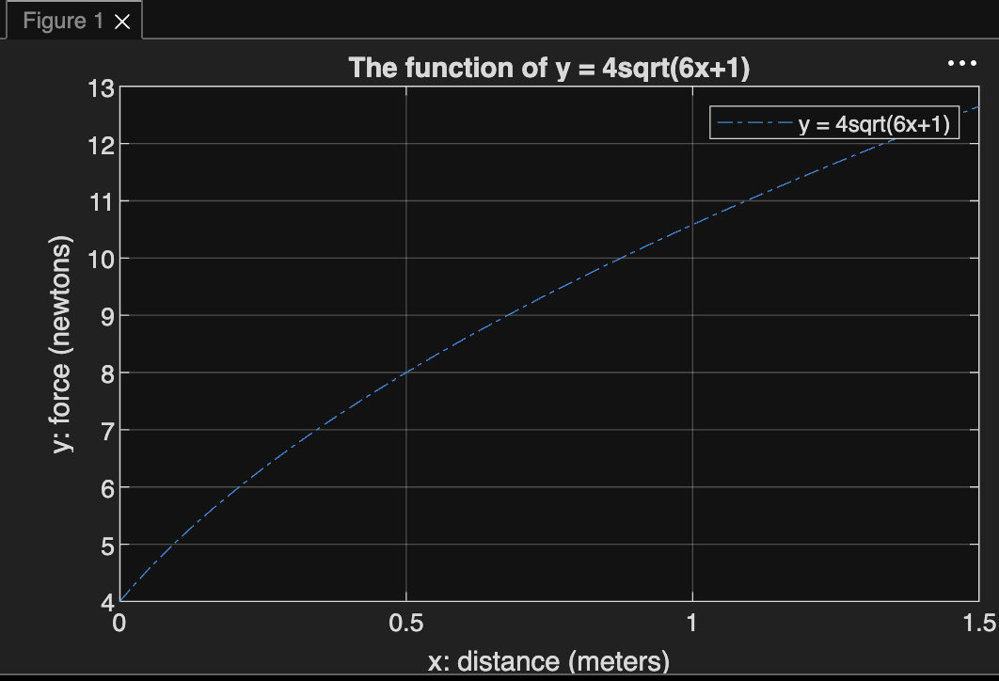
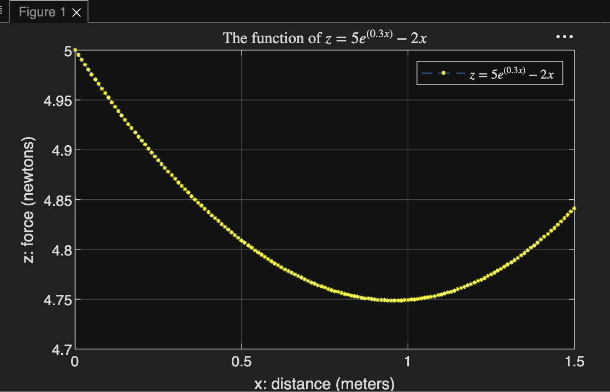
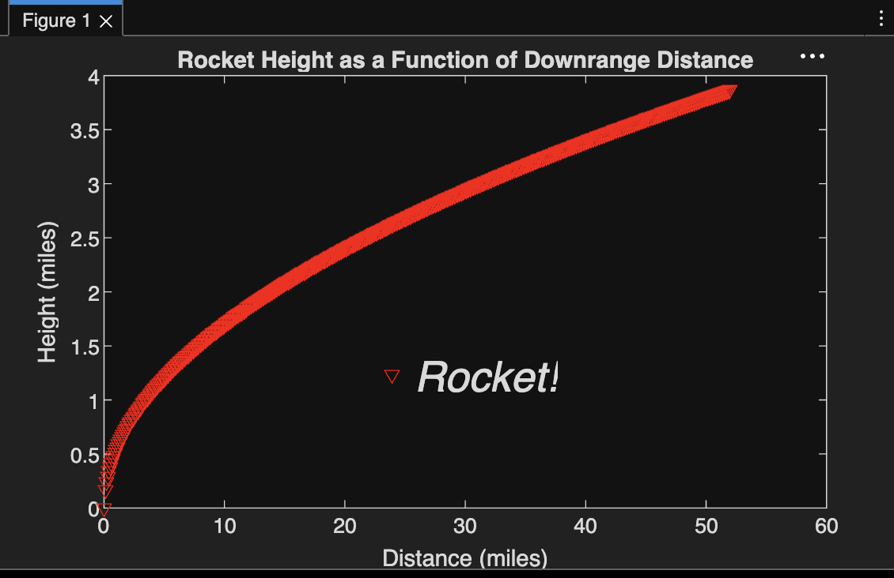

# MATLAB Lab Notebook

**Course:** ENGR60 — Programming & Problem-Solving in MATLAB
**Name:** Alexandra Yakovleva
**Started:** September 7 4, 2026

---

## Table of Contents

- [Lesson 1 Slides: About MATLAB](#lesson-1-slides-about-matlab)
- [Week 1 — Lab 1](#week-1--lab-1)
- [Week 2 — Lab 2](#week-2--lab-2)
  - [Arrays (Chapter 2)](#arrays-chapter-2)
  - [Polynomial Roots](#polynomial-roots)
  - [Plotting with MATLAB (Chapter 5)](#plotting-with-matlab-chapter-5)
  - [Script Files](#script-files)
  - [Narrative — Projectile Motion](#narrative--projectile-motion)
- [SDC Chapter 2 — Operators, Variables & Data Types](#sdc-chapter-2--operators-variables--data-types)
  - [2.1 Operators](#21-operators)
  - [2.2 Variables & Precedence](#22-variables--precedence)
  - [2.3 Variable Naming & Classes](#23-variable-naming--classes)
  - [2.4 Integer & Floating-Point Types](#24-integer--floating-point-types)
  - [2.5 Numerical Functions & Rounding](#25-numerical-functions--rounding)
  - [2.6 Strings & Character Arrays](#26-strings--character-arrays)
  - [2.7 Importing Data (VCF Files)](#27-importing-data-vcf-files)
- [SDC Chapter 2 — Exercises](#sdc-chapter-2--exercises) 
---

## Lesson 1 Slides: About MATLAB

*Source: Matlab_WVC-Lesson1-1 (Lecture 1 slides)*

### Textbooks

- **Required:** *An Engineer's Introduction to Programming with MATLAB 2019*, by Shawna Lockhart & Eric Tilleson
- **Optional:** *Getting Started with MATLAB 5*, by Rudra Pratap
- **Optional:** *Introduction to MATLAB 7 for Engineers*, by Palm

### Purchasing MATLAB Software

- MathWorks website: [mathworks.com](http://www.mathworks.com) — The only option now available for individual student purchase is the $119 per year, a Standard Student Suite, which bundles MATLAB, Simulink, and 11 add-on toolboxes into a single annual subscription-based service
- **Alternative:** Octave (free), available as a PC download or online.

### Outline

1. About MATLAB
2. Basics
3. Computing with MATLAB
4. Arrays and Matrices Operations

### About MATLAB

MATLAB is:
- A computer programming language
- A software environment for using that language effectively

**Two modes of operation:**
- **Interactive calculator mode** — commands typed and executed one at a time
- **Script mode** — execution of complete programs (script files)

Running MATLAB opens one or more windows. The primary one is the **MATLAB Desktop**, the main graphical user interface, which contains and manages all other MATLAB windows. Depending on configuration, some windows may or may not be visible — check the **View** menu.


**MATLAB Desktop windows:**

| Window | Purpose |
|---|---|
| **Command Window** | Primary place to interact with MATLAB; the `>>` prompt is where commands are issued (type `quit` or `exit` to close) |
| **Command History** | Running history of prior commands issued in the Command Window |
| **Workspace** | GUI for viewing, loading, and saving MATLAB variables |
| **Launch Pad** | Tree layout for accessing tools, demos, and documentation |
| **Current Directory** | GUI for directory and file manipulation |
| **Help** | GUI for finding and viewing online documentation |
| **Array Editor** | GUI for modifying the contents of MATLAB variables |
| **Editor/Debugger** | Text editor and debugger for MATLAB `.m` files |

### Basics: Basic Operations

| Symbol | Operation | MATLAB form |
|---|---|---|
| `^` | exponentiation: aᵇ | `a^b` |
| `*` | multiplication: ab | `a*b` |
| `/` | right division: a/b | `a/b` |
| `\` | left division: b/a | `a\b` |
| `+` | addition: a + b | `a+b` |
| `-` | subtraction: a − b | `a-b` |

**Examples:**
```matlab
>> 5^2
ans =
    25

>> cos(pi)
ans =
    -1
```

### Basics: Rules of Precedence

| Precedence | Operation |
|---|---|
| First | Parentheses, evaluated starting with the innermost pair |
| Second | Exponentiation, evaluated left to right |
| Third | Multiplication and division (equal precedence), left to right |
| Fourth | Addition and subtraction (equal precedence), left to right |

**Precedence examples:**
```
8 + 3 * 5 = 23            → (8 + (3 * 5))
4 ^ 2 – 12 – 8 / 4 * 2 = 0 → ((4^2) – 12 – ((8/4) * 2))
3 * 4 ^ 2 + 5 = 53         → ((3 * (4^2)) + 5)
27 ^ 1 / 3 + 32 ^ 0.2 = 11 → (((27^1) / 3) + (32^0.2))
```
*Text reference: page 10*

---

## Week 1 — Lab 1

*Source: Lab1-1 assignment notes*

Your first exercise using MATLAB begins with calculations.

**What is MATLAB?** A numerical computation computer application that basically performs symbolic algebra — computations done in terms of symbols and variables instead of pure numbers.

As shown in the slides, typing into the Command Window:
```matlab
>> 5^2
```
should return `25`.

Once comfortable with the basic operations from the slides, the lab moves on to computations and symbolic algebra in MATLAB (or Octave, if MATLAB isn't installed).


Useful commands to memorize (used frequently throughout the course):

| Command | Action |
|---|---|
| `clc` | Clears the Command Window |
| `clear` | Removes all variables from memory |
| `clear var1 var2` | Removes the variables `var1` and `var2` from memory |
| `exist('name')` | Determines if a file or variable named `'name'` exists |
| `quit` | Stops MATLAB |
| `who` | Lists variables currently in memory |
| `whos` | Lists variables, sizes, and whether they have imaginary parts |
| `:` | Colon — generates an array of regularly spaced elements |
| `,` | Comma — separates elements of an array |
| `;` | Semicolon — suppresses screen printing; also denotes a new row in an array |
| `...` | Ellipsis — continues a line |

### T1-1 — Use MATLAB to compute the following

**a.** 6(10/13) + 18/(5·7) + 5(9²)
```matlab
>> 6*(10/13) + 18/(5*7) + 5*(9^2)
ans =
   410.1297
```

**b.** 6(35^(1/4)) + 14^0.35
```matlab
>> 6*(35^(1/4)) + 14^0.35
ans =
   17.1123
```

---
## Week 2 — Lab 2

### T1-1 (repeated, parts c & d)

**c.** 6(10/13) + 18/(5·7) + 5(9²)
```matlab
>> 6*(10/13) + 18/(5*7) + 5*(9^2)
ans =
   410.1297
```

**d.** 6(35^(1/4)) + 14^0.35
```matlab
>> 6*(35^(1/4)) + 14^0.35
ans =
   17.1123
```

### Cylinder Problem

The volume of a circular cylinder of height *h* and radius *r* is V = πr²h. A cylindrical tank is 15 m tall with a radius of 8 m. Construct another tank with 20% greater volume but the same height — how large must its radius be?

**Solution:** r = √(V / πh)

```matlab
>> r = 8;
>> h = 15;
>> V = pi*(r^2)*h;
>> V = V + 0.2*V;
>> r = sqrt(V/(pi*h))
ans =
    r = 8.7636
```

**Answer:** The new cylinder must have a radius of **8.7636 m**.

### T1-2: Test Your Understanding

Given x = -5 + 9i and y = 6 - 2i, show that x+y = 1 + 7i, xy = -12 + 64i, and x/y = -1.2 + 1.1i.

```matlab
>> x = -5 + 9*i;
>> y = 6 - 2*i;
>> x + y
ans =
   1.0000 + 7.0000i

>> x*y
ans =
  -12.0000 +64.0000i

>> x/y
ans =
  -1.2000 + 1.1000i
```

### Arrays (Chapter 2)
```matlab
>> u = [0:0.1:10];
>> w = 5*sin(u);
>> u(7)
ans =
    0.6000

>> w(7)
ans =
    2.8232

>> m = length(w)
m =
   101
```

### T3-1: 25th Element

Determine how many elements are in the array `[cos(0):0.02:log10(100)]`, and find the 25th element.

```matlab
>> a = [cos(0):0.02:log10(100)];
>> m = length(a)
m =
    51

>> a(25)
ans =
    1.4800
```

**Answer:** There are 51 elements in the array, and the 25th element is 1.48.

### Polynomial Roots

**Example)** Find the roots of x³ − 7x² + 40x − 34 = 0.

```matlab
>> a = [1, -7, 40, -34];
>> roots(a)
ans =
   3.0000 + 5.0000i
   3.0000 - 5.0000i
   1.0000 + 0.0000i
```

**Answer:** The roots are x = 1 and x = 3 ± 5i.

### T3-2: Polynomial 290 − 11x + 6x² + x³

```matlab
>> a = [1, 6, -11, 290];
>> roots(a)
ans =
  -10.0000 + 0.0000i
    2.0000 + 5.0000i
    2.0000 - 5.0000i
```

**Answer:** The roots are x = -10 and x = 2 ± 5i.

### Plotting with MATLAB (Chapter 5)
**Example)** Plot $y = sin(2x)$ for $0 \le x \le 10$.

```matlab
>> x = 0:0.01:10;
>> y = sin(2*x);
>> plot(x, y, linewidth=2) 
>> xlabel('x')
>> ylabel('y')
>> legend('y = sin2x') 
>> grid on
>> title('Function y = sin2x') 
```



### T3-3: Plot $s = 2sin(3t+2) + \sqrt {(5t+1)}$ for $0 \le t \le 5$:

```matlab
>> t = 0:0.01:5;
>> s = 2*sin(3*t + 2) + sqrt(5*t + 1);
>> plot(t,s, linewidth=2, LineStyle="--", Color= 'r')
>> xlabel('t: time (seconds)')
>> ylabel('s: speed (feet per second)')
>> title('The function of s = 2sin(3t+2)+sqrt(5t+1)')
>> legend('y = s = 2sin(3t+2)+sqrt(5t+1)') 
>> grid on

```



### T3-4: $y = 4* \sqrt {6x+1}$ and $z = 5e^{0.3x} − 2x$ for $0 \le x \le 1.5$:

```matlab
>> x = 0:0.01:1.5;
>> y = 4*sqrt(6*x+1);
>> z = 5*exp(0.3*x) - 2*x;
>> plot(x,y, linestyle='-.')
>> xlabel('x: distance (meters)')
>> ylabel('y: force (newtons)'), ...
>> title('The function of y = 4sqrt(6x+1)')
>> grid on;
>> legend('y = 4sqrt(6x+1)')
```



```matlab
>> plot(x,z, '--*', 'MarkerSize', 3, 'MarkerEdgeColor', 'y') 
>> xlabel('x: distance (meters)'), ylabel('z: force (newtons)'), ...
>> title('The function of $z = 5e^{(0.3x)}-2x$', 'Interpreter', 'latex')
>> legend('$z = 5e^{(0.3x)}-2x$', 'Interpreter', 'latex')
>> grid on

```



**Example) Plot of rocket height**

```matlab
>> x = 0:0.1:52;
>> y = 0.4*sqrt(1.8*x);
>> x = 0:0.1:52;
>> plot(x,y, 'vr')
>> xlabel('Distance (miles)')
>> ylabel('Height (miles)')
>> title('Rocket Height as a Function of Downrange Distance')
>> legend('Rocket!', 'Box', 'off', 'fontsize', 20, 'FontAngle', 'italic')
```



### Script Files

**Sample SQRT)** Example #1 of a script file (`Sample_SQRT.m`):

```matlab
% Example of a script file
% This program calculates the square root of the numbers 1 through 10.
% It displays a vector x with the numbers 1 through 10
% and the vector y with the square root.
x = 1:10
y = sqrt(x)
```

```matlab
>> Sample_SQRT
x =
    1   2   3   4   5   6   7   8   9   10
y =
   1.0000  1.4142  1.7321  2.0000  2.2361  2.4495  2.6458  2.8284  3.0000  3.1623
```

**Population Table)** Example #2 of a script file (`PopTable.m`):

```matlab
% Example of a script file (PopTable.m)
% This program will display the population along with years.
yr = [1984 1986 1988 1990 1992 1994 1996];
pop = [127 130 136 145 158 178 211];
tableYP(:,1) = yr';
tableYP(:,2) = pop';
disp('        YEAR      POPULATION')
disp('                  (MILLIONS)')
disp('')
disp(tableYP)
```

```matlab
>> PopTable
    YEAR   POPULATION
           (MILLIONS)
    1984      127
    1986      130
    1988      136
    1990      145
    1992      158
    1994      178
    1996      211
```

**Power of 3 by User Input)** Example #3 of a script file (`Power3input.m`):

```matlab
% Example of a script file (Power3input.m)
% This program will display "the power (cube or exponent) of 3" of the
% number entered by user.
n = 1:10;
c = n.^3;
number1 = input('Enter the points scored in the first game: ');
if number1 < 0
    display('Warning! Input invalid')
else
    number2 = number1^3
    disp(number2)
end
```

```matlab
>> Power3input
Enter the points scored in the first game: 3
number2 =
   27
   27

>> Power3input
Enter the points scored in the first game: 6
number2 =
   216
   216

>> Power3input
Enter the points scored in the first game: -5
Warning! Input invalid
```

**Average points per game)** Example #4 of a script file (`sampleAVG.m`):

```matlab
% Example of a script file (sampleAVG.m)
% This program will display the values of the points from 3 games.
game1 = 75;
game2 = 93;
game3 = 68;
ave_points = (game1 + game2 + game3) / 3
```

```matlab
>> sampleAVG
ave_points =
   78.6667
```

**Average points by User Input)** Example #5 of a script file (`sampleGameInput.m`):

```matlab
% Example of a script file (sampleGameInput.m)
% This script file calculates the average of points scored in 3 games.
% The points from each game are assigned to the variables by using the
% input command.
game1 = input('Enter the points scored in the first game: ');
game2 = input('Enter the points scored in the second game: ');
game3 = input('Enter the points scored in the third game: ');
ave_points = (game1 + game2 + game3) / 3
disp('')
disp('The average of points scored in a game is: ')
disp('')
disp(ave_points)
```

```matlab
>> sampleGameInput
Enter the points scored in the first game: 61
Enter the points scored in the second game: 74
Enter the points scored in the third game: 101
ave_points =
   78.6667
The average of points scored in a game is:
   78.6667
```

### Narrative — Projectile Motion

**Predict landing distance of an object in projectile motion.** The object is launched at 45 degrees from ground level at 50 meters per second. Ignore air drag and wind.

**Variables:**
- Angle: 45° (= 45° × π/180° rad = π/4 rad = 0.7854 rad)
- Speed: 50 (m/s)
- Starting height: 0 (m)
- Gravity: -9.81 (m/s²)

**MATLAB coding (`ProjectileMotion.m`):**

```matlab
% Example of a script file (ProjectileMotion.m)
% This script file calculates the horizontal velocity, vertical velocity,
% time in flight, horizontal distance of an object in projectile motion.
angle = pi/4;
speed = 50;
startingHeight = 0;
gravity = -9.81;
HorizontalVelocity = speed*cos(angle)
VerticalVelocity = speed*sin(angle)
TimeInFlight = VerticalVelocity/(abs(gravity/2))
HorizontalDistance = TimeInFlight*HorizontalVelocity
```

```matlab
>> ProjectileMotion
HorizontalVelocity =
   35.3553
VerticalVelocity =
   35.3553
TimeInFlight =
   7.2080
HorizontalDistance =
   254.8420
```

**Answer:**
- Horizontal starting velocity = 35.3553 m/s
- Vertical starting velocity = 35.3553 m/s
- Time in flight: 7.2080 s
- Horizontal distance from start: 254.8420 m

*(EOF)*

---

## SDC Chapter 2 — Operators, Variables & Data Types

*Self-directed coursework notes*

### Chapter 2 Objectives

1. Understand and apply operator precedence.
2. Assign a value to a variable.
3. Understand the minimum and maximum value of various numeric variable types.
4. Understand the difference between string and character arrays.
5. Work with data from an imported file.

### 2.1 Operators

**Arithmetic Operators (p.15)**
| Operator | Meaning |
|---|---|
| `+` | Addition (3+2) |
| `-` | Subtraction (3-2) |
| `*` | Multiplication (3*2) |
| `/` | Division (3/2) |
| `^` | Raise to a power (3^2) |
**Relational Operators (p.15)**
| Operator | Meaning |
|---|---|
| `<` | Less than |
| `<=` | Less than or equal to |
| `>` | Greater than |
| `>=` | Greater than or equal to |
| `==` | Equals |
| `~=` | Does not equal |

> (p.16) Using a single equals sign, `=`, assigns the value on the right side to the variable on the left side. Using two, `==`, asks whether the two sides are mathematically/logically equal (1 for True, 0 for False).
**Logical Operators (p.16)**

| Operator | Meaning |
|---|---|
| `&&` | and |
| `\|\|` | or |
| `~` | not |

> (p.17) The `~` operator reverses the logical value it's applied to — true (1) becomes false (0) and vice versa.
> ```matlab
> >> ~(x==3)
> ans =
>   logical
>    0
> ```
> Since x was previously set to 3, `x==3` evaluates to true, and `~` reverses it to false (0).

**The `&` operator (and)** — true only when both compared values are true:

| X | Y | X & Y | Explanation |
|---|---|---|---|
| True (1) | True (1) | True (1) | X & Y is true if X is true and Y is true |
| True (1) | False (0) | False (0) | X & Y is false if X is true and Y is false |
| False (0) | True (1) | False (0) | X & Y is false if X is false and Y is true |
| False (0) | False (0) | False (0) | X & Y is false if X is false and Y is false |

**The `|` operator (or)** — true when either or both compared values are true:

| X | Y | X \| Y | Explanation |
|---|---|---|---|
| True (1) | True (1) | True (1) | X \| Y is true if X is true and Y is true |
| True (1) | False (0) | True (1) | X \| Y is true if X is true and Y is false |
| False (0) | True (1) | True (1) | X \| Y is true if X is false and Y is true |
| False (0) | False (0) | False (0) | X \| Y is true if X is false and Y is false |

### 2.2 Variables & Precedence

(p.18) Type into the Command Window:

```matlab
>> x=3
x =
    3
>> y=2
y =
    2
>> z=2
z =
    2
>> x==y
ans =
  logical
   0
>> y==z
ans =
  logical
   1
>> x==y & y==z
ans =
  logical
   0
>> x==y | y==z
ans =
  logical
   1
>> ~(x==y) & y==z
ans =
  logical
   1
```

**Logical type / `class()` / `islogical()`:**

```matlab
>> x=1;
>> y=logical(1);      % assigned y to be logical 1
>> class(x)            % asks the class of the variable x
ans =
    'double'
>> class(y)             % asks the class of the variable y
ans =
    'logical'
>> islogical(x)          % returned false(0) because not assigned logical
ans =
  logical
   0
>> islogical(y)           % returned true(1) because assigned logical
ans =
  logical
   1
```

`double` is the default numeric data type in MATLAB and stores values between ±3.4×10³⁸. Use `islogical()` to check whether a value is of type `logical`.

**Operator precedence (p.18-19)**

```matlab
>> 3+2*6
ans =
    15
>> (3+2)*6
ans =
    30
```

The `==` relational operator has higher precedence than `&&`/`||` — this is why `x == y` and `y == z` were evaluated *before* the `&`/`|` operators above.

**Order of Operations (p.19)**
1. Parentheses
2. Logical negation (`~`), unary minus (`-`)
3. Multiplication, division
4. Addition, subtraction
5. Relational operators (`<`, `<=`, `>`, `>=`, `==`, `~=`)
6. Logical AND (`&`)
7. Logical OR (`|`)

A variable holds a value; it has a name (e.g. `x` or `city`) assigned a value (e.g. `3` or `'Paris'`).

**Variable Naming Rules (p.19)**

- Can include letters, numbers, and underscores
- MUST begin with a letter, cannot begin with a number. Underscore ok.
- Names with capital and lowercase letters are **not** interchangeable (`abc` and `Abc` are different variables)

### 2.3 Variable Naming & Classes
(p.19-20) Type into the Command Window:

```matlab
>> a=5
a =
    5
>> A=15
A =
   15
>> a+3
ans =
    8
>> A+3
ans =
   18
>> A+a
ans =
   20
>> win_win=3
win_win =
    3
>> 2win=3
2win=3
   ↑
Error: Unexpected 'win'.
Check for missing multiplication operator.
>> win-win=3
win-win=3
   ↑
Incorrect use of '=' operator. Assign a value to
a variable using '=' and compare values for equality
using '=='.
>> win.win=3
win =
  struct with fields:
    win: 3
```

**Invalid variable names:**

| Invalid name | Result | Reason |
|---|---|---|
| `2win` | Error: Unexpected MATLAB expression | Variable begins with a number |
| `win-win` | Error: The expression to the left of the equals sign is not a valid target for an assignment | MATLAB thinks you're subtracting a variable called `win` from itself |
| `win.win` | A new structure `win` is created with a member `win` | The name contains an invalid character but is a valid way to refer to a member of a structure (an advanced data type covered later); MATLAB creates it instead of erroring |

> (p.20) It's best to write code that's easily understood by others, since other programmers will review and later maintain it — use descriptive variable names (e.g. `altitude_in_meters`). You can also click and drag variable names from the Workspace and Editor into the Command Window to avoid retyping them.


**Classes / types (p.21):**
```matlab
>> x=666
x =
   666
>> class(x)
ans =
    'double'
```

Even though an integer was entered, MATLAB creates a `double` by default unless the type is explicitly specified.

```matlab
>> x=int8(666);
>> class(x)
ans =
    'int8'
```

`int8` stores the number as an 8-bit integer. The `class` function reports the class/type. The number of bits determines how many binary digits the value can store; if one bit is reserved for the sign, the storable range shrinks accordingly.

| 2⁷ | 2⁶ | 2⁵ | 2⁴ | 2³ | 2² | 2¹ | 2⁰ |
|---|---|---|---|---|---|---|---|
| 1 | 1 | 1 | 1 | 1 | 1 | 1 | 1 |
| 128 | 64 | 32 | 16 | 8 | 4 | 2 | 1 | = 255 |


### 2.4 Integer & Floating-Point Types

**Integer Types (p.21)**
| Type | Bits | Signed/Unsigned | Range |
|---|---|---|---|
| `int8` | 8 | signed | -128 to 127 |
| `uint8` | 8 | unsigned | 0 to 255 |
| `int16` | 16 | signed | -32,768 to 32,767 |
| `uint16` | 16 | unsigned | 0 to 65,535 |
| `int32` | 32 | signed | -2,147,483,648 to 2,147,483,647 |
| `uint32` | 32 | unsigned | 0 to 4,294,967,295 |
| `int64` | 64 | signed | -9,223,372,036,854,775,808 to 9,223,372,036,854,775,807 |
| `uint64` | 64 | unsigned | 0 to 18,446,744,073,709,551,615 |

Supplying a type to `intmin()` / `intmax()` tells you the minimum/maximum value that type can hold.

**Floating Point Types (p.22)**
| Type | Bits | Signed/Unsigned | Range |
|---|---|---|---|
| `single` | 32 | signed | -1.79×10³⁸ to 1.79×10³⁸ |
| `double` | 64 | signed | -1.79×10³⁰⁸ to 1.79×10³⁰⁸ |

**Constants — `Inf` and `NaN` (p.22)**

A constant is a value that, once assigned, cannot be changed. Two special floating-point values result from certain operations:

```matlab
>> 3/0
ans =
    Inf
>> inf-inf
ans =
    NaN
```

Instead of an error, MATLAB returns `Inf` (or `-Inf`) for results that are enormously large/small, and `NaN` ("not a number") for operations that are not mathematically defined. `pi` is another built-in constant:

```matlab
>> format long
>> pi
ans =
   3.141592653589793
>> pi+7
ans =
   10.141592653589793
```

**Overflow behavior (p.22-23)**
```matlab
>> x=128 +2
x =
   130
>> y=int8(128)+2
y =
  int8
   127
>> z=int8(128)
z =
  int8
   127
```

If a number is larger or smaller than a type can handle, MATLAB returns the largest/smallest value that type can hold, with no error (127 is as high as an `int8` can go).


### 2.5 Numerical Functions & Rounding
| Function | Action |
|---|---|
| `ceil` | Rounds toward positive infinity |
| `floor` | Rounds toward negative infinity |
| `fix` | Rounds toward zero |
| `round` | Rounds toward the nearest whole number |
| `mod(a, b)` | Modulus of a divided by b; retains the sign of the divisor (e.g. `mod(10, -7)` returns -4) |
| `rem(a, b)` | Remainder of a division; retains the sign of the dividend (e.g. `rem(10, -7)` returns 3) |

```matlab
>> ceil(3.4)
ans =
    4
>> ceil(-3.4)
ans =
   -3
>> floor(3.4)
ans =
    3
>> floor(-3.4)
ans =
   -4
>> fix(3.4)
ans =
    3
>> fix(-3.4)
ans =
   -3
>> round(3.4)
ans =
    3
>> round(-3.4)
ans =
   -3
>> mod(5, 2)
ans =
    1
>> rem(5, 2)
ans =
    1
>> mod(5, -2)
ans =
   -1
>> rem(5, -2)
ans =
    1
>> mod(-5, 2)
ans =
    1
>> rem(-5, 2)
ans =
   -1
```

**Precision loss on conversion (p.24)**
```matlab
>> x=uint8(255)
x =
  uint8
   255
>> y=int8(x)
y =
  int8
   127
```

`int16(43)` converts the double `43` into a 16-bit integer. Converting unsigned types to signed types can easily lose precision or exceed the range. (Search MATLAB help for "trigonometry" to see the full list of available trig functions.)

### 2.6 Strings & Character Arrays
(p.24) A **string** holds text and can contain any valid character (`"123456"`, `"< <= > >="`, etc.). An **array** is a collection of data all of the same type, each item accessible by index. Consider the phrase "Carpe diem." stored as a character array:

| Index | 1 | 2 | 3 | 4 | 5 | 6 | 7 | 8 | 9 | 10 | 11 |
|---|---|---|---|---|---|---|---|---|---|---|---|
| Character | C | a | r | p | e | (space) | d | i | e | m | . |

This is a 1×11 one-dimensional array of characters.

```matlab
>> st='Carpe diem.'
st =
    'Carpe diem.'
>> size(st)
ans =
    1   11
>> length(st)
ans =
   11
>> st(4)
ans =
    'p'
>> st(4)='9'
st =
    'Car9e diem.'
>> st(4)=33
st =
    'Car!e diem.'
```

`size()` reports the array's dimensions (1×11); `length()` reports the number of elements (11). `st(4)` accesses a specific element. Setting `st(4) = 33` overwrites that element with the character whose ASCII code is 33 (`!`) — all elements of a character-array variable must share the same type, so numeric values are interpreted as ASCII codes.

**Character arrays vs. string arrays (p.26)**
Character arrays use single quotes (`'the'`); string arrays use double quotes (`"the"`), producing a 1×1 array containing one string. A character array is a 1×length array of individual characters; a string array is a 1×1 array containing a single string.

```matlab
>> clc
>> sc='This is a character array'
sc =
    'This is a character array'
>> st="This is a string array"
st =
    "This is a string array"
>> class(sc)
ans =
    'char'
>> class(st)
ans =
    'string'
>> size(sc)
ans =
    1   25
>> length(sc)
ans =
   25
>> size(st)
ans =
    1    1
>> length(st)
ans =
    1
>> sc(1)
ans =
    'T'
>> st(1)
ans =
    "This is a string array"
>> sc(2)='H';
>> sc
sc =
    'THis is a character array'
>> st(2)="And this is the second dtring in the array";
>> st
st =
  1x2 string array
    Column 1
      "This is a string array"
    Column 2
      "And this is the second dtr..."
```

**Character/string test functions (p.27-28)**
```matlab
>> charArray='This is a character array.'
>> stringArray="This is a string array."
>> ischar(charArray)
ans =
  logical
   1
>> ischar(stringArray)
ans =
  logical
   0
>> isstring(stringArray)
ans =
  logical
   1
>> isletter(charArray)
ans =
  1x26 logical array
  Columns 1 through 14
   1 1 1 1 0 1 0 1 0 1 1 1 1 1
  Columns 15 through 26
   1 1 1 1 0 1 1 1 1 0
>> isspace(charArray)
ans =
  1x26 logical array
  Columns 1 through 14
   0 0 0 0 1 0 0 1 0 0 0 0 0 0
  Columns 15 through 26
   0 0 0 0 1 0 0 0 0 0
>> upper(stringArray)
ans =
    "THIS IS A STRING ARRAY."
>> stringArray=upper(stringArray)
stringArray =
    "THIS IS A STRING ARRAY."
```

Search "Characters and Strings" in MATLAB help for the full function list.

**Comparing strings — `strcmp` (p.28)**
Whenever you want to compare two strings, use `strcmp(a, b)`.

```matlab
>> text1='Four score an seven years ago'
>> text2='87 years ago'
>> text3='Four score and seven years ago'
>> strcmp(text1, text2)
ans =
  logical
   0
>> strcmp(text1, text3)
ans =
  logical
   1
>> text1==text3
ans =
  1x30 logical array
  Columns 1 through 14
   1 1 1 1 1 1 1 1 1 1 1 1 1 1
  Columns 15 through 28
   1 1 1 1 1 1 1 1 1 1 1 1 1 1
  Columns 29 through 30
   1 1
```

**Finding & modifying substrings (p.28-29)**
```matlab
>> contains(text1, 'seven')
ans =
  logical
   1
>> strfind(text1, 'seven')
ans =
   16
>> insertBefore(text1, strfind(text1, 'seven'), 'fifty-')
ans =
    'Four score and fifty-seven years ago'
```

`contains` tells you the substring `'seven'` is present; `strfind` reports where (the `'s'` of "seven" is at index 16). `insertBefore` shows a function used as a value within another function — when parentheses are nested, MATLAB highlights the matching open parenthesis to help track them.

**Type coercion (p.29-30)**
```matlab
>> x=3
>> class(x)
ans =
    'double'
>> x='I am some text'
>> class(x)
ans =
    'char'
```

A variable becomes the type of whatever is assigned to it, regardless of its previous type.

```matlab
>> x=3
>> y=single(5)
>> z=x+y
>> class(z)
ans =
    'single'
>> x=int16(5)+int8(3)
Error using  +
Integers can only be combined with
integers of the same class, or scalar
doubles.
```

Integer types can't be freely mixed with each other — only with same-class integers or scalar doubles; this restriction doesn't apply to floating-point types.

```matlab
>> x=3
>> y='I am a string'
>> z=x+y
z =
  Columns 1 through 7
   76  35  100  112  35  100  35
  Columns 8 through 13
   118  119  117  108  113  106
>> class(z)
ans =
    'double'
>> char(z)
ans =
    'L#dp#d#vwulqj'
```

MATLAB treated the string as a character array, added 3 to each character's ASCII value, and returned a numeric array of those values. `char(z)` casts the array back to a character-array string based on the (shifted) ASCII values.

### 2.7 Importing Data (VCF Files)

**Definition of VCF**
**Steps to Import Data (p.32-34)**
**Sorting imported data (p.34)**

## SDC Chapter 2 — Exercises

*(p.36-38) Exercises 2.1 – 2.8*

### 2.1
### 2.2
### 2.3
### 2.4
### 2.5
### 2.6
### 2.7
### 2.8
