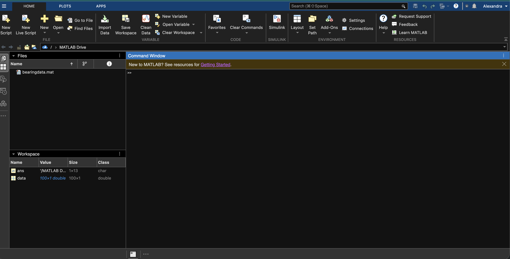
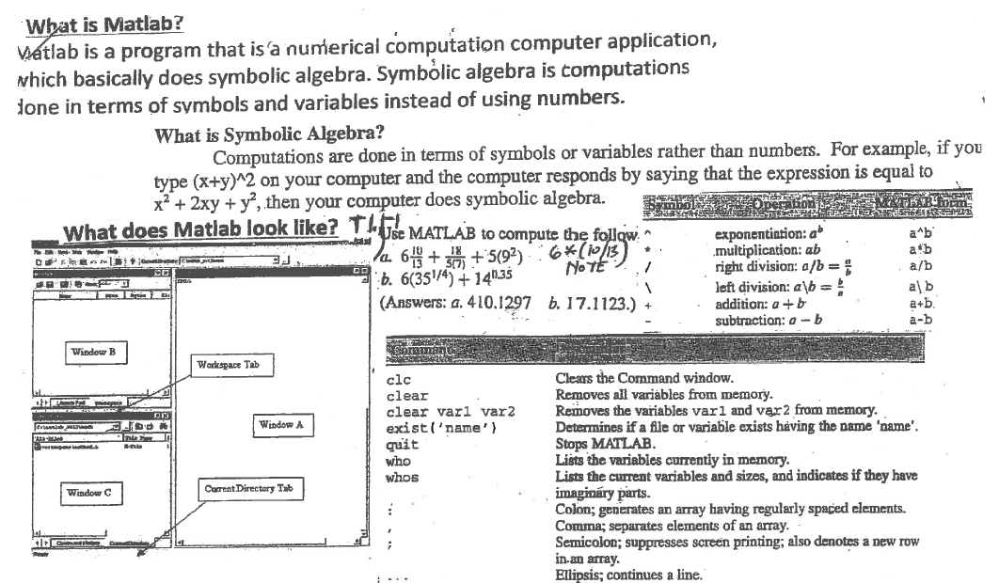
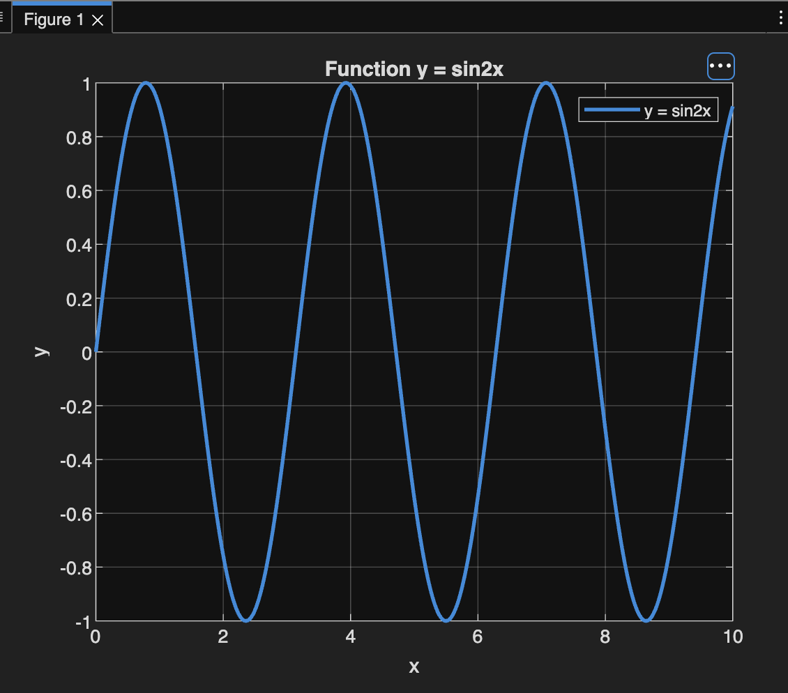
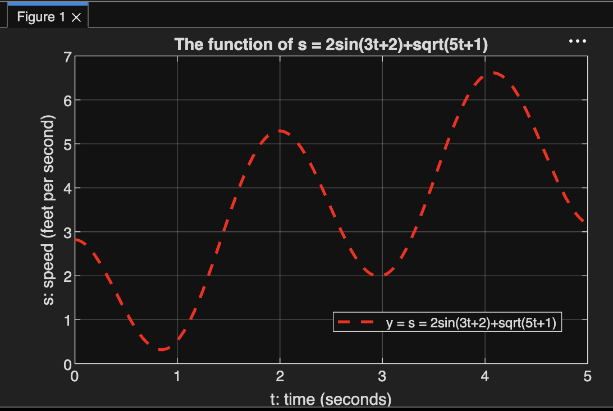
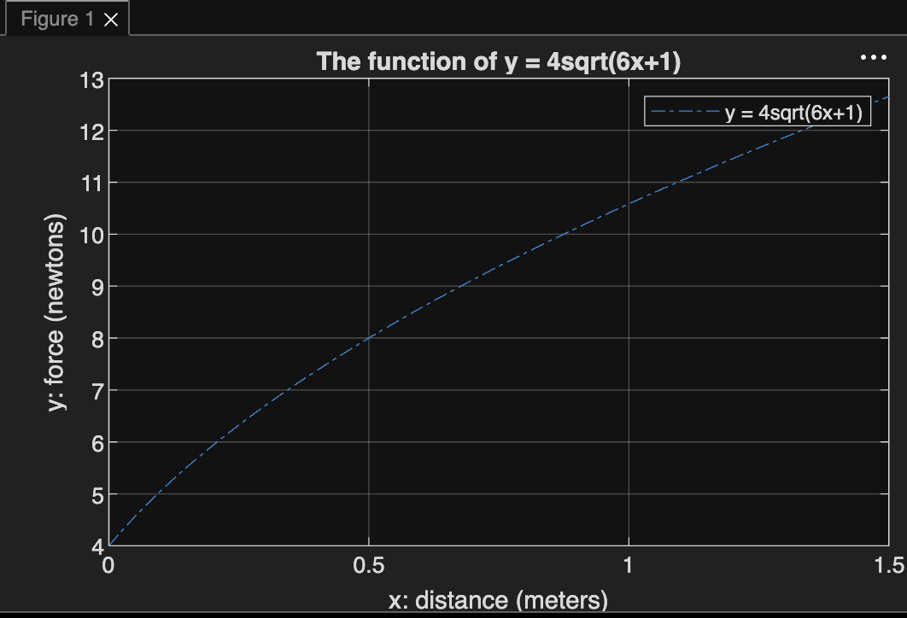
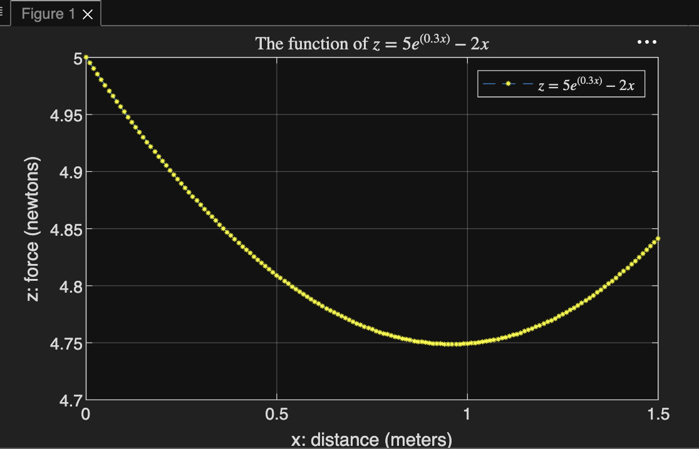
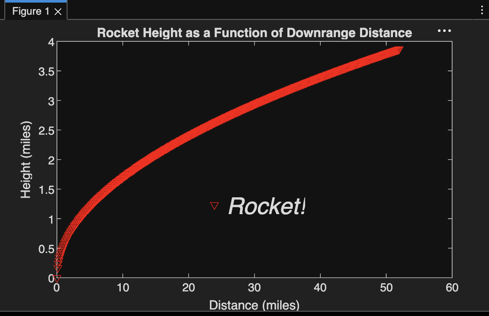
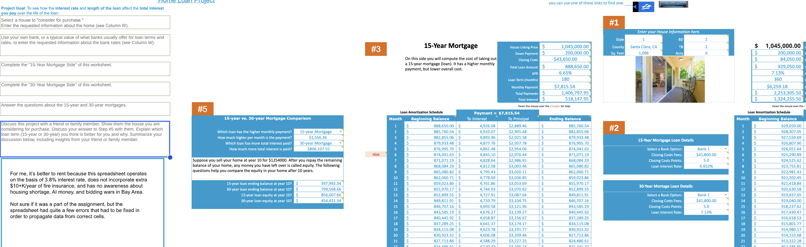

# MATLAB Lab Notebook

**Course:** ENGR60 — Programming & Problem-Solving in MATLAB
**Name:** Alexandra Yakovleva
**Started:** September 7 4, 2026

---

## Table of Contents

- [Lesson 1 Slides: About MATLAB](#lesson-1-slides-about-matlab)
- [Week 1 — Lab 1](#week-1--lab-1)
- [Week 2 — Lab 2](#week-2--lab-2)
  - [Arrays (Chapter 2)](#arrays-chapter-2)
  - [Polynomial Roots](#polynomial-roots)
  - [Plotting with MATLAB (Chapter 5)](#plotting-with-matlab-chapter-5)
  - [Script Files](#script-files)
  - [Narrative — Projectile Motion](#narrative--projectile-motion)
- [SDC Chapter 2 — Operators, Variables & Data Types](#sdc-chapter-2--operators-variables--data-types)
  - [2.1 Operators](#21-operators)
  - [2.2 Variables & Precedence](#22-variables--precedence)
  - [2.3 Variable Naming & Classes](#23-variable-naming--classes)
  - [2.4 Integer & Floating-Point Types](#24-integer--floating-point-types)
  - [2.5 Numerical Functions & Rounding](#25-numerical-functions--rounding)
  - [2.6 Strings & Character Arrays](#26-strings--character-arrays)
  - [2.7 Importing Data (VCF Files)](#27-importing-data-vcf-files)
- [SDC Chapter 2 — Exercises](#sdc-chapter-2--exercises)
- [Home Loan Assignment](#home-loan-assignment) 
- [SDC Chapter 3 — Arrays, Structures & Tables](#sdc-chapter-3--arrays-structures--tables)
  - [3.1 Arrays, Matrices, Vectors & Scalars](#31-arrays-matrices-vectors--scalars)
  - [3.2 Growing Arrays & the Empty Array](#32-growing-arrays--the-empty-array)
  - [3.3 Matrix Basics & Size](#33-matrix-basics--size)
  - [3.4 Strings as Matrices](#34-strings-as-matrices)
  - [3.5 The Colon Operator](#35-the-colon-operator)
  - [3.6 Indexing with Colon & End](#36-indexing-with-colon--end)
  - [3.7 Reshaping & Array Functions](#37-reshaping--array-functions)
  - [3.8 Cell Arrays](#38-cell-arrays)
  - [3.9 Structures](#39-structures)
  - [3.10 Structure Arrays](#310-structure-arrays)
  - [3.11 Creating Tables](#311-creating-tables)
  - [3.12 Table Properties](#312-table-properties)
  - [3.13 Accessing & Adding Table Data](#313-accessing--adding-table-data)
  - [3.14 Table Conversion Functions](#314-table-conversion-functions)
- [SDC Chapter 3 — Exercises](#sdc-chapter-3--exercises) 
---

## Lesson 1 Slides: About MATLAB

*Source: Matlab_WVC-Lesson1-1 (Lecture 1 slides)*

### Textbooks

- **Required:** *An Engineer's Introduction to Programming with MATLAB 2019*, by Shawna Lockhart & Eric Tilleson
- **Optional:** *Getting Started with MATLAB 5*, by Rudra Pratap
- **Optional:** *Introduction to MATLAB 7 for Engineers*, by Palm

### Purchasing MATLAB Software

- MathWorks website: [mathworks.com](http://www.mathworks.com) — The only option now available for individual student purchase is the $119 per year, a Standard Student Suite, which bundles MATLAB, Simulink, and 11 add-on toolboxes into a single annual subscription-based service
- **Alternative:** Octave (free), available as a PC download or online.

### Outline

1. About MATLAB
2. Basics
3. Computing with MATLAB
4. Arrays and Matrices Operations

### About MATLAB

MATLAB is:
- A computer programming language
- A software environment for using that language effectively

**Two modes of operation:**
- **Interactive calculator mode** — commands typed and executed one at a time
- **Script mode** — execution of complete programs (script files)

Running MATLAB opens one or more windows. The primary one is the **MATLAB Desktop**, the main graphical user interface, which contains and manages all other MATLAB windows. Depending on configuration, some windows may or may not be visible — check the **View** menu.



**MATLAB Desktop windows:**

| Window | Purpose |
|---|---|
| **Command Window** | Primary place to interact with MATLAB; the `>>` prompt is where commands are issued (type `quit` or `exit` to close) |
| **Command History** | Running history of prior commands issued in the Command Window |
| **Workspace** | GUI for viewing, loading, and saving MATLAB variables |
| **Launch Pad** | Tree layout for accessing tools, demos, and documentation |
| **Current Directory** | GUI for directory and file manipulation |
| **Help** | GUI for finding and viewing online documentation |
| **Array Editor** | GUI for modifying the contents of MATLAB variables |
| **Editor/Debugger** | Text editor and debugger for MATLAB `.m` files |

### Basics: Basic Operations

| Symbol | Operation | MATLAB form |
|---|---|---|
| `^` | exponentiation: aᵇ | `a^b` |
| `*` | multiplication: ab | `a*b` |
| `/` | right division: a/b | `a/b` |
| `\` | left division: b/a | `a\b` |
| `+` | addition: a + b | `a+b` |
| `-` | subtraction: a − b | `a-b` |

**Examples:**
```matlab
>> 5^2
ans =
    25

>> cos(pi)
ans =
    -1
```

### Basics: Rules of Precedence

| Precedence | Operation |
|---|---|
| First | Parentheses, evaluated starting with the innermost pair |
| Second | Exponentiation, evaluated left to right |
| Third | Multiplication and division (equal precedence), left to right |
| Fourth | Addition and subtraction (equal precedence), left to right |

**Precedence examples:**
```
8 + 3 * 5 = 23            → (8 + (3 * 5))
4 ^ 2 – 12 – 8 / 4 * 2 = 0 → ((4^2) – 12 – ((8/4) * 2))
3 * 4 ^ 2 + 5 = 53         → ((3 * (4^2)) + 5)
27 ^ 1 / 3 + 32 ^ 0.2 = 11 → (((27^1) / 3) + (32^0.2))
```
*Text reference: page 10*

---

## Week 1 — Lab 1

*Source: Lab1-1 assignment notes*

Your first exercise using MATLAB begins with calculations.

**What is MATLAB?** A numerical computation computer application that basically performs symbolic algebra — computations done in terms of symbols and variables instead of pure numbers.

As shown in the slides, typing into the Command Window:
```matlab
>> 5^2
```
should return `25`.

Once comfortable with the basic operations from the slides, the lab moves on to computations and symbolic algebra in MATLAB (or Octave, if MATLAB isn't installed).



Useful commands to memorize (used frequently throughout the course):

| Command | Action |
|---|---|
| `clc` | Clears the Command Window |
| `clear` | Removes all variables from memory |
| `clear var1 var2` | Removes the variables `var1` and `var2` from memory |
| `exist('name')` | Determines if a file or variable named `'name'` exists |
| `quit` | Stops MATLAB |
| `who` | Lists variables currently in memory |
| `whos` | Lists variables, sizes, and whether they have imaginary parts |
| `:` | Colon — generates an array of regularly spaced elements |
| `,` | Comma — separates elements of an array |
| `;` | Semicolon — suppresses screen printing; also denotes a new row in an array |
| `...` | Ellipsis — continues a line |

### T1-1 — Use MATLAB to compute the following

**a.** 6(10/13) + 18/(5·7) + 5(9²)
```matlab
>> 6*(10/13) + 18/(5*7) + 5*(9^2)
ans =
   410.1297
```

**b.** 6(35^(1/4)) + 14^0.35
```matlab
>> 6*(35^(1/4)) + 14^0.35
ans =
   17.1123
```

---
## Week 2 — Lab 2

### T1-1 (repeated, parts c & d)

**c.** 6(10/13) + 18/(5·7) + 5(9²)
```matlab
>> 6*(10/13) + 18/(5*7) + 5*(9^2)
ans =
   410.1297
```

**d.** 6(35^(1/4)) + 14^0.35
```matlab
>> 6*(35^(1/4)) + 14^0.35
ans =
   17.1123
```

### Cylinder Problem

The volume of a circular cylinder of height *h* and radius *r* is V = πr²h. A cylindrical tank is 15 m tall with a radius of 8 m. Construct another tank with 20% greater volume but the same height — how large must its radius be?

**Solution:** r = √(V / πh)

```matlab
>> r = 8;
>> h = 15;
>> V = pi*(r^2)*h;
>> V = V + 0.2*V;
>> r = sqrt(V/(pi*h))
ans =
    r = 8.7636
```

**Answer:** The new cylinder must have a radius of **8.7636 m**.

### T1-2: Test Your Understanding

Given x = -5 + 9i and y = 6 - 2i, show that x+y = 1 + 7i, xy = -12 + 64i, and x/y = -1.2 + 1.1i.

```matlab
>> x = -5 + 9*i;
>> y = 6 - 2*i;
>> x + y
ans =
   1.0000 + 7.0000i

>> x*y
ans =
  -12.0000 +64.0000i

>> x/y
ans =
  -1.2000 + 1.1000i
```

### Arrays (Chapter 2)
```matlab
>> u = [0:0.1:10];
>> w = 5*sin(u);
>> u(7)
ans =
    0.6000

>> w(7)
ans =
    2.8232

>> m = length(w)
m =
   101
```

### T3-1: 25th Element

Determine how many elements are in the array `[cos(0):0.02:log10(100)]`, and find the 25th element.

```matlab
>> a = [cos(0):0.02:log10(100)];
>> m = length(a)
m =
    51

>> a(25)
ans =
    1.4800
```

**Answer:** There are 51 elements in the array, and the 25th element is 1.48.

### Polynomial Roots

**Example)** Find the roots of x³ − 7x² + 40x − 34 = 0.

```matlab
>> a = [1, -7, 40, -34];
>> roots(a)
ans =
   3.0000 + 5.0000i
   3.0000 - 5.0000i
   1.0000 + 0.0000i
```

**Answer:** The roots are x = 1 and x = 3 ± 5i.

### T3-2: Polynomial 290 − 11x + 6x² + x³

```matlab
>> a = [1, 6, -11, 290];
>> roots(a)
ans =
  -10.0000 + 0.0000i
    2.0000 + 5.0000i
    2.0000 - 5.0000i
```

**Answer:** The roots are x = -10 and x = 2 ± 5i.

### Plotting with MATLAB (Chapter 5)
**Example)** Plot $y = sin(2x)$ for $0 \le x \le 10$.

```matlab
>> x = 0:0.01:10;
>> y = sin(2*x);
>> plot(x, y, linewidth=2) 
>> xlabel('x')
>> ylabel('y')
>> legend('y = sin2x') 
>> grid on
>> title('Function y = sin2x') 
```



### T3-3: Plot $s = 2sin(3t+2) + \sqrt {(5t+1)}$ for $0 \le t \le 5$:

```matlab
>> t = 0:0.01:5;
>> s = 2*sin(3*t + 2) + sqrt(5*t + 1);
>> plot(t,s, linewidth=2, LineStyle="--", Color= 'r')
>> xlabel('t: time (seconds)')
>> ylabel('s: speed (feet per second)')
>> title('The function of s = 2sin(3t+2)+sqrt(5t+1)')
>> legend('y = s = 2sin(3t+2)+sqrt(5t+1)') 
>> grid on

```



### T3-4: $y = 4* \sqrt {6x+1}$ and $z = 5e^{0.3x} − 2x$ for $0 \le x \le 1.5$:

```matlab
>> x = 0:0.01:1.5;
>> y = 4*sqrt(6*x+1);
>> z = 5*exp(0.3*x) - 2*x;
>> plot(x,y, linestyle='-.')
>> xlabel('x: distance (meters)')
>> ylabel('y: force (newtons)'), ...
>> title('The function of y = 4sqrt(6x+1)')
>> grid on;
>> legend('y = 4sqrt(6x+1)')
```



```matlab
>> plot(x,z, '--*', 'MarkerSize', 3, 'MarkerEdgeColor', 'y') 
>> xlabel('x: distance (meters)'), ylabel('z: force (newtons)'), ...
>> title('The function of $z = 5e^{(0.3x)}-2x$', 'Interpreter', 'latex')
>> legend('$z = 5e^{(0.3x)}-2x$', 'Interpreter', 'latex')
>> grid on

```



**Example) Plot of rocket height**

```matlab
>> x = 0:0.1:52;
>> y = 0.4*sqrt(1.8*x);
>> x = 0:0.1:52;
>> plot(x,y, 'vr')
>> xlabel('Distance (miles)')
>> ylabel('Height (miles)')
>> title('Rocket Height as a Function of Downrange Distance')
>> legend('Rocket!', 'Box', 'off', 'fontsize', 20, 'FontAngle', 'italic')
```



### Script Files

**Sample SQRT)** Example #1 of a script file (`Sample_SQRT.m`):

```matlab
% Example of a script file
% This program calculates the square root of the numbers 1 through 10.
% It displays a vector x with the numbers 1 through 10
% and the vector y with the square root.
x = 1:10
y = sqrt(x)
```

```matlab
>> Sample_SQRT
x =
    1   2   3   4   5   6   7   8   9   10
y =
   1.0000  1.4142  1.7321  2.0000  2.2361  2.4495  2.6458  2.8284  3.0000  3.1623
```

**Population Table)** Example #2 of a script file (`PopTable.m`):

```matlab
% Example of a script file (PopTable.m)
% This program will display the population along with years.
yr = [1984 1986 1988 1990 1992 1994 1996];
pop = [127 130 136 145 158 178 211];
tableYP(:,1) = yr';
tableYP(:,2) = pop';
disp('        YEAR      POPULATION')
disp('                  (MILLIONS)')
disp('')
disp(tableYP)
```

```matlab
>> PopTable
    YEAR   POPULATION
           (MILLIONS)
    1984      127
    1986      130
    1988      136
    1990      145
    1992      158
    1994      178
    1996      211
```

**Power of 3 by User Input)** Example #3 of a script file (`Power3input.m`):

```matlab
% Example of a script file (Power3input.m)
% This program will display "the power (cube or exponent) of 3" of the
% number entered by user.
n = 1:10;
c = n.^3;
number1 = input('Enter the points scored in the first game: ');
if number1 < 0
    display('Warning! Input invalid')
else
    number2 = number1^3
    disp(number2)
end
```

```matlab
>> Power3input
Enter the points scored in the first game: 3
number2 =
   27
   27

>> Power3input
Enter the points scored in the first game: 6
number2 =
   216
   216

>> Power3input
Enter the points scored in the first game: -5
Warning! Input invalid
```

**Average points per game)** Example #4 of a script file (`sampleAVG.m`):

```matlab
% Example of a script file (sampleAVG.m)
% This program will display the values of the points from 3 games.
game1 = 75;
game2 = 93;
game3 = 68;
ave_points = (game1 + game2 + game3) / 3
```

```matlab
>> sampleAVG
ave_points =
   78.6667
```

**Average points by User Input)** Example #5 of a script file (`sampleGameInput.m`):

```matlab
% Example of a script file (sampleGameInput.m)
% This script file calculates the average of points scored in 3 games.
% The points from each game are assigned to the variables by using the
% input command.
game1 = input('Enter the points scored in the first game: ');
game2 = input('Enter the points scored in the second game: ');
game3 = input('Enter the points scored in the third game: ');
ave_points = (game1 + game2 + game3) / 3
disp('')
disp('The average of points scored in a game is: ')
disp('')
disp(ave_points)
```

```matlab
>> sampleGameInput
Enter the points scored in the first game: 61
Enter the points scored in the second game: 74
Enter the points scored in the third game: 101
ave_points =
   78.6667
The average of points scored in a game is:
   78.6667
```

### Narrative — Projectile Motion

**Predict landing distance of an object in projectile motion.** The object is launched at 45 degrees from ground level at 50 meters per second. Ignore air drag and wind.

**Variables:**
- Angle: 45° (= 45° × π/180° rad = π/4 rad = 0.7854 rad)
- Speed: 50 (m/s)
- Starting height: 0 (m)
- Gravity: -9.81 (m/s²)

**MATLAB coding (`ProjectileMotion.m`):**

```matlab
% Example of a script file (ProjectileMotion.m)
% This script file calculates the horizontal velocity, vertical velocity,
% time in flight, horizontal distance of an object in projectile motion.
angle = pi/4;
speed = 50;
startingHeight = 0;
gravity = -9.81;
HorizontalVelocity = speed*cos(angle)
VerticalVelocity = speed*sin(angle)
TimeInFlight = VerticalVelocity/(abs(gravity/2))
HorizontalDistance = TimeInFlight*HorizontalVelocity
```

```matlab
>> ProjectileMotion
HorizontalVelocity =
   35.3553
VerticalVelocity =
   35.3553
TimeInFlight =
   7.2080
HorizontalDistance =
   254.8420
```

**Answer:**
- Horizontal starting velocity = 35.3553 m/s
- Vertical starting velocity = 35.3553 m/s
- Time in flight: 7.2080 s
- Horizontal distance from start: 254.8420 m

*(EOF)*

---

## SDC Chapter 2 — Operators, Variables & Data Types

*Self-directed coursework notes*

### Chapter 2 Objectives

1. Understand and apply operator precedence.
2. Assign a value to a variable.
3. Understand the minimum and maximum value of various numeric variable types.
4. Understand the difference between string and character arrays.
5. Work with data from an imported file.

### 2.1 Operators

**Arithmetic Operators (p.15)**
| Operator | Meaning |
|---|---|
| `+` | Addition (3+2) |
| `-` | Subtraction (3-2) |
| `*` | Multiplication (3*2) |
| `/` | Division (3/2) |
| `^` | Raise to a power (3^2) |
**Relational Operators (p.15)**
| Operator | Meaning |
|---|---|
| `<` | Less than |
| `<=` | Less than or equal to |
| `>` | Greater than |
| `>=` | Greater than or equal to |
| `==` | Equals |
| `~=` | Does not equal |

> (p.16) Using a single equals sign, `=`, assigns the value on the right side to the variable on the left side. Using two, `==`, asks whether the two sides are mathematically/logically equal (1 for True, 0 for False).
**Logical Operators (p.16)**

| Operator | Meaning |
|---|---|
| `&&` | and |
| `\|\|` | or |
| `~` | not |

> (p.17) The `~` operator reverses the logical value it's applied to — true (1) becomes false (0) and vice versa.
> ```matlab
> >> ~(x==3)
> ans =
>   logical
>    0
> ```
> Since x was previously set to 3, `x==3` evaluates to true, and `~` reverses it to false (0).

**The `&` operator (and)** — true only when both compared values are true:

| X | Y | X & Y | Explanation |
|---|---|---|---|
| True (1) | True (1) | True (1) | X & Y is true if X is true and Y is true |
| True (1) | False (0) | False (0) | X & Y is false if X is true and Y is false |
| False (0) | True (1) | False (0) | X & Y is false if X is false and Y is true |
| False (0) | False (0) | False (0) | X & Y is false if X is false and Y is false |

**The `|` operator (or)** — true when either or both compared values are true:

| X | Y | X \| Y | Explanation |
|---|---|---|---|
| True (1) | True (1) | True (1) | X \| Y is true if X is true and Y is true |
| True (1) | False (0) | True (1) | X \| Y is true if X is true and Y is false |
| False (0) | True (1) | True (1) | X \| Y is true if X is false and Y is true |
| False (0) | False (0) | False (0) | X \| Y is true if X is false and Y is false |

### 2.2 Variables & Precedence

(p.18) Type into the Command Window:

```matlab
>> x=3
x =
    3
>> y=2
y =
    2
>> z=2
z =
    2
>> x==y
ans =
  logical
   0
>> y==z
ans =
  logical
   1
>> x==y & y==z
ans =
  logical
   0
>> x==y | y==z
ans =
  logical
   1
>> ~(x==y) & y==z
ans =
  logical
   1
```

**Logical type / `class()` / `islogical()`:**

```matlab
>> x=1;
>> y=logical(1);      % assigned y to be logical 1
>> class(x)            % asks the class of the variable x
ans =
    'double'
>> class(y)             % asks the class of the variable y
ans =
    'logical'
>> islogical(x)          % returned false(0) because not assigned logical
ans =
  logical
   0
>> islogical(y)           % returned true(1) because assigned logical
ans =
  logical
   1
```

`double` is the default numeric data type in MATLAB and stores values between ±3.4×10³⁸. Use `islogical()` to check whether a value is of type `logical`.

**Operator precedence (p.18-19)**

```matlab
>> 3+2*6
ans =
    15
>> (3+2)*6
ans =
    30
```

The `==` relational operator has higher precedence than `&&`/`||` — this is why `x == y` and `y == z` were evaluated *before* the `&`/`|` operators above.

**Order of Operations (p.19)**
1. Parentheses
2. Logical negation (`~`), unary minus (`-`)
3. Multiplication, division
4. Addition, subtraction
5. Relational operators (`<`, `<=`, `>`, `>=`, `==`, `~=`)
6. Logical AND (`&`)
7. Logical OR (`|`)

A variable holds a value; it has a name (e.g. `x` or `city`) assigned a value (e.g. `3` or `'Paris'`).

**Variable Naming Rules (p.19)**

- Can include letters, numbers, and underscores
- MUST begin with a letter, cannot begin with a number. Underscore ok.
- Names with capital and lowercase letters are **not** interchangeable (`abc` and `Abc` are different variables)

### 2.3 Variable Naming & Classes
(p.19-20) Type into the Command Window:

```matlab
>> a=5
a =
    5
>> A=15
A =
   15
>> a+3
ans =
    8
>> A+3
ans =
   18
>> A+a
ans =
   20
>> win_win=3
win_win =
    3
>> 2win=3
2win=3
   ↑
Error: Unexpected 'win'.
Check for missing multiplication operator.
>> win-win=3
win-win=3
   ↑
Incorrect use of '=' operator. Assign a value to
a variable using '=' and compare values for equality
using '=='.
>> win.win=3
win =
  struct with fields:
    win: 3
```

**Invalid variable names:**

| Invalid name | Result | Reason |
|---|---|---|
| `2win` | Error: Unexpected MATLAB expression | Variable begins with a number |
| `win-win` | Error: The expression to the left of the equals sign is not a valid target for an assignment | MATLAB thinks you're subtracting a variable called `win` from itself |
| `win.win` | A new structure `win` is created with a member `win` | The name contains an invalid character but is a valid way to refer to a member of a structure (an advanced data type covered later); MATLAB creates it instead of erroring |

> (p.20) It's best to write code that's easily understood by others, since other programmers will review and later maintain it — use descriptive variable names (e.g. `altitude_in_meters`). You can also click and drag variable names from the Workspace and Editor into the Command Window to avoid retyping them.


**Classes / types (p.21):**
```matlab
>> x=666
x =
   666
>> class(x)
ans =
    'double'
```

Even though an integer was entered, MATLAB creates a `double` by default unless the type is explicitly specified.

```matlab
>> x=int8(666);
>> class(x)
ans =
    'int8'
```

`int8` stores the number as an 8-bit integer. The `class` function reports the class/type. The number of bits determines how many binary digits the value can store; if one bit is reserved for the sign, the storable range shrinks accordingly.

| 2⁷ | 2⁶ | 2⁵ | 2⁴ | 2³ | 2² | 2¹ | 2⁰ |
|---|---|---|---|---|---|---|---|
| 1 | 1 | 1 | 1 | 1 | 1 | 1 | 1 |
| 128 | 64 | 32 | 16 | 8 | 4 | 2 | 1 | = 255 |


### 2.4 Integer & Floating-Point Types

**Integer Types (p.21)**
| Type | Bits | Signed/Unsigned | Range |
|---|---|---|---|
| `int8` | 8 | signed | -128 to 127 |
| `uint8` | 8 | unsigned | 0 to 255 |
| `int16` | 16 | signed | -32,768 to 32,767 |
| `uint16` | 16 | unsigned | 0 to 65,535 |
| `int32` | 32 | signed | -2,147,483,648 to 2,147,483,647 |
| `uint32` | 32 | unsigned | 0 to 4,294,967,295 |
| `int64` | 64 | signed | -9,223,372,036,854,775,808 to 9,223,372,036,854,775,807 |
| `uint64` | 64 | unsigned | 0 to 18,446,744,073,709,551,615 |

Supplying a type to `intmin()` / `intmax()` tells you the minimum/maximum value that type can hold.

**Floating Point Types (p.22)**
| Type | Bits | Signed/Unsigned | Range |
|---|---|---|---|
| `single` | 32 | signed | -1.79×10³⁸ to 1.79×10³⁸ |
| `double` | 64 | signed | -1.79×10³⁰⁸ to 1.79×10³⁰⁸ |

**Constants — `Inf` and `NaN` (p.22)**

A constant is a value that, once assigned, cannot be changed. Two special floating-point values result from certain operations:

```matlab
>> 3/0
ans =
    Inf
>> inf-inf
ans =
    NaN
```

Instead of an error, MATLAB returns `Inf` (or `-Inf`) for results that are enormously large/small, and `NaN` ("not a number") for operations that are not mathematically defined. `pi` is another built-in constant:

```matlab
>> format long
>> pi
ans =
   3.141592653589793
>> pi+7
ans =
   10.141592653589793
```

**Overflow behavior (p.22-23)**
```matlab
>> x=128 +2
x =
   130
>> y=int8(128)+2
y =
  int8
   127
>> z=int8(128)
z =
  int8
   127
```

If a number is larger or smaller than a type can handle, MATLAB returns the largest/smallest value that type can hold, with no error (127 is as high as an `int8` can go).


### 2.5 Numerical Functions & Rounding
| Function | Action |
|---|---|
| `ceil` | Rounds toward positive infinity |
| `floor` | Rounds toward negative infinity |
| `fix` | Rounds toward zero |
| `round` | Rounds toward the nearest whole number |
| `mod(a, b)` | Modulus of a divided by b; retains the sign of the divisor (e.g. `mod(10, -7)` returns -4) |
| `rem(a, b)` | Remainder of a division; retains the sign of the dividend (e.g. `rem(10, -7)` returns 3) |

```matlab
>> ceil(3.4)
ans =
    4
>> ceil(-3.4)
ans =
   -3
>> floor(3.4)
ans =
    3
>> floor(-3.4)
ans =
   -4
>> fix(3.4)
ans =
    3
>> fix(-3.4)
ans =
   -3
>> round(3.4)
ans =
    3
>> round(-3.4)
ans =
   -3
>> mod(5, 2)
ans =
    1
>> rem(5, 2)
ans =
    1
>> mod(5, -2)
ans =
   -1
>> rem(5, -2)
ans =
    1
>> mod(-5, 2)
ans =
    1
>> rem(-5, 2)
ans =
   -1
```

**Precision loss on conversion (p.24)**
```matlab
>> x=uint8(255)
x =
  uint8
   255
>> y=int8(x)
y =
  int8
   127
```

`int16(43)` converts the double `43` into a 16-bit integer. Converting unsigned types to signed types can easily lose precision or exceed the range. (Search MATLAB help for "trigonometry" to see the full list of available trig functions.)

### 2.6 Strings & Character Arrays
(p.24) A **string** holds text and can contain any valid character (`"123456"`, `"< <= > >="`, etc.). An **array** is a collection of data all of the same type, each item accessible by index. Consider the phrase "Carpe diem." stored as a character array:

| Index | 1 | 2 | 3 | 4 | 5 | 6 | 7 | 8 | 9 | 10 | 11 |
|---|---|---|---|---|---|---|---|---|---|---|---|
| Character | C | a | r | p | e | (space) | d | i | e | m | . |

This is a 1×11 one-dimensional array of characters.

```matlab
>> st='Carpe diem.'
st =
    'Carpe diem.'
>> size(st)
ans =
    1   11
>> length(st)
ans =
   11
>> st(4)
ans =
    'p'
>> st(4)='9'
st =
    'Car9e diem.'
>> st(4)=33
st =
    'Car!e diem.'
```

`size()` reports the array's dimensions (1×11); `length()` reports the number of elements (11). `st(4)` accesses a specific element. Setting `st(4) = 33` overwrites that element with the character whose ASCII code is 33 (`!`) — all elements of a character-array variable must share the same type, so numeric values are interpreted as ASCII codes.

**Character arrays vs. string arrays (p.26)**
Character arrays use single quotes (`'the'`); string arrays use double quotes (`"the"`), producing a 1×1 array containing one string. A character array is a 1×length array of individual characters; a string array is a 1×1 array containing a single string.

```matlab
>> clc
>> sc='This is a character array'
sc =
    'This is a character array'
>> st="This is a string array"
st =
    "This is a string array"
>> class(sc)
ans =
    'char'
>> class(st)
ans =
    'string'
>> size(sc)
ans =
    1   25
>> length(sc)
ans =
   25
>> size(st)
ans =
    1    1
>> length(st)
ans =
    1
>> sc(1)
ans =
    'T'
>> st(1)
ans =
    "This is a string array"
>> sc(2)='H';
>> sc
sc =
    'THis is a character array'
>> st(2)="And this is the second dtring in the array";
>> st
st =
  1x2 string array
    Column 1
      "This is a string array"
    Column 2
      "And this is the second dtr..."
```

**Character/string test functions (p.27-28)**
```matlab
>> charArray='This is a character array.'
>> stringArray="This is a string array."
>> ischar(charArray)
ans =
  logical
   1
>> ischar(stringArray)
ans =
  logical
   0
>> isstring(stringArray)
ans =
  logical
   1
>> isletter(charArray)
ans =
  1x26 logical array
  Columns 1 through 14
   1 1 1 1 0 1 0 1 0 1 1 1 1 1
  Columns 15 through 26
   1 1 1 1 0 1 1 1 1 0
>> isspace(charArray)
ans =
  1x26 logical array
  Columns 1 through 14
   0 0 0 0 1 0 0 1 0 0 0 0 0 0
  Columns 15 through 26
   0 0 0 0 1 0 0 0 0 0
>> upper(stringArray)
ans =
    "THIS IS A STRING ARRAY."
>> stringArray=upper(stringArray)
stringArray =
    "THIS IS A STRING ARRAY."
```

Search "Characters and Strings" in MATLAB help for the full function list.

**Comparing strings — `strcmp` (p.28)**
Whenever you want to compare two strings, use `strcmp(a, b)`.

```matlab
>> text1='Four score an seven years ago'
>> text2='87 years ago'
>> text3='Four score and seven years ago'
>> strcmp(text1, text2)
ans =
  logical
   0
>> strcmp(text1, text3)
ans =
  logical
   1
>> text1==text3
ans =
  1x30 logical array
  Columns 1 through 14
   1 1 1 1 1 1 1 1 1 1 1 1 1 1
  Columns 15 through 28
   1 1 1 1 1 1 1 1 1 1 1 1 1 1
  Columns 29 through 30
   1 1
```

**Finding & modifying substrings (p.28-29)**
```matlab
>> contains(text1, 'seven')
ans =
  logical
   1
>> strfind(text1, 'seven')
ans =
   16
>> insertBefore(text1, strfind(text1, 'seven'), 'fifty-')
ans =
    'Four score and fifty-seven years ago'
```

`contains` tells you the substring `'seven'` is present; `strfind` reports where (the `'s'` of "seven" is at index 16). `insertBefore` shows a function used as a value within another function — when parentheses are nested, MATLAB highlights the matching open parenthesis to help track them.

**Type coercion (p.29-30)**
```matlab
>> x=3
>> class(x)
ans =
    'double'
>> x='I am some text'
>> class(x)
ans =
    'char'
```

A variable becomes the type of whatever is assigned to it, regardless of its previous type.

```matlab
>> x=3
>> y=single(5)
>> z=x+y
>> class(z)
ans =
    'single'
>> x=int16(5)+int8(3)
Error using  +
Integers can only be combined with
integers of the same class, or scalar
doubles.
```

Integer types can't be freely mixed with each other — only with same-class integers or scalar doubles; this restriction doesn't apply to floating-point types.

```matlab
>> x=3
>> y='I am a string'
>> z=x+y
z =
  Columns 1 through 7
   76  35  100  112  35  100  35
  Columns 8 through 13
   118  119  117  108  113  106
>> class(z)
ans =
    'double'
>> char(z)
ans =
    'L#dp#d#vwulqj'
```

MATLAB treated the string as a character array, added 3 to each character's ASCII value, and returned a numeric array of those values. `char(z)` casts the array back to a character-array string based on the (shifted) ASCII values.

### 2.7 Importing Data (VCF Files)

(p.31) A **Variant Call Format (VCF)** file contains information about positions in the genome and genotype information for each sample. It's a text file with a header section followed by this required data per line:

| Field | Description |
|---|---|
| `CHROM` | Chromosome number. (Course dataset only has chromosome 22 data.) |
| `POS` | Position — location of the gene on the chromosome (range ~1 to 1.2 million; no decimal portion) |
| `ID` | dbSNP identifier(s); `.` if none available (string, no whitespace/semicolons) |
| `REF` | Reference base(s) — one of A, C, G, T, or N (not case-sensitive; more than one letter allowed; string) |
| `ALT` | Alternate base(s) — A, C, G, T, N, or `*` (missing due to upstream deletion) |
| `QUAL` | Quality score (Phred-scale); course dataset uses 100 throughout |
| `FILTER` | Filter status; `"PASS"` indicates a passing quality score |
| `INFO` | Additional info keys, e.g. AA (ancestral allele), AC (allele count), AF (allele frequency) |

**Steps to Import Data (p.32-34)**

1. Use the **Import Data** tool from the Home tab of the ribbon.
2. Change the file filter to **All Files (\*.\*)** to show the `.vcf` file.
3. Set **Text Type** to **String Array**. *(Note: this setting wasn't found in the Import Data window during this exercise.)*
4. Leave the **Output Type** as **Table**.
5. Data has delimiters (tabs), so leave the option set to **Tab delimited**. *(Note: this setting also wasn't located.)*
6. Choose a row for the **Variable Names** (or double-click the header to set names after importing), and select the data **Range** from the same menu.
7. Click **Import Selection** to add the data to the Workspace; double-click it there to open.

**Sorting imported data (p.34)**

To sort the data by `'ID'` (or any column):

```matlab
>> tblIDs=sortrows(ChromeExport2, 'ID')
tblIDs =
  36x9 table
  CHROM     POS         ID          REF   ALT   QUAL   FILTER
  -----   --------   -------------   ---   ---   ----   ------
    22    16050678   "rs139377059"    C     T     100    PASS
    22    16050984   "rs188945759"    C     G     100    PASS
    22    16050922   "rs367963583"    T     G     100    PASS
    22    16050627   "rs587593704"    G     T     100    PASS
    22    16050840   "rs587616822"    C     G     100    PASS
```

The new variable `tblIDs` appears in the Workspace alongside `ChromeExport2`. The sorted data was saved to the `datafiles-matlab` folder as `Chrome22data.mat`.

---

## SDC Chapter 2 — Exercises

*(p.36-38) Exercises 2.1 – 2.8*

### 2.1

Based on operator precedence, predict the result without using MATLAB:

**5 + 2 \* 8 / 2 − (3 \* 2 + 10) / -1**

Work the parentheses first (multiplication before addition inside): `3*2+10 = 16`. Then left-to-right multiplication/division: `5 + 8 − (-16)`. Finally addition/subtraction left to right: **29**.

```matlab
>> 5+2*8/2-(3*2+10)/-1
ans =
   29
```
Yes, the answers agree.

### 2.2

Predict the value of `z`:
```matlab
>> x=1
>> y=5
>> z=~(x<y||~(y<x)&&islogical(x))
```

The `&&` operation happens before `||` (order of operations). To evaluate `&&`, first compute `~(y<x)`, which is `1`. `islogical(x)` is `0`, so `1 && 0 = 0`. Then `1 || 0 = 1`, and `~(1) = 0`. Expected: **0**.

```matlab
>> x=1
x =
    1
>> y=5
y =
    5
>> z=~(x<y||~(y<x)&&islogical(x))
z =
  logical
   0
```
Yes, the answers agree.

### 2.3

Predict both the value and data type of `x`:

**x = 55 + uint32(-22) + pi**

`uint32` is unsigned and starts at 0, so the closest value it can represent for -22 is 0. Then `55 + 0 + pi = 58.14159…`, and the result should take on type `uint32`.

```matlab
>> x=55+uint32(-22)+pi
x =
  uint32
   58
```
The answers are slightly different — MATLAB displays just the whole number (`58`) rather than `58.14159…`. This demonstrates that variable types follow strict rules, and misunderstanding them can silently produce unexpected results (the integer type truncates/rounds the floating-point result).

### 2.4

Predict the value of each:
```matlab
>> int8(ceil(127.1))
>> int8(floor(127.9))
>> int8(fix(127.5))
>> int8(round(127.7))
>> int8(ceil(rem(-528.6,200)))
```

Predicted, in order: **127, 127, 127, 127, -128**

```matlab
>> int8(ceil(127.1))
ans =
  int8
   127
>> int8(floor(127.9))
ans =
  int8
   127
>> int8(fix(127.5))
ans =
  int8
   127
>> int8(round(127.7))
ans =
  int8
   127
>> int8(ceil(rem(-528.6,200)))
ans =
  int8
   -128
```
Yes, the numbers match.

### 2.5

Predict what you'd expect to see (generally, not precisely) from the last two lines:
```matlab
>> x='small kittens'
>> y="small kittens"
>> 3+x
>> 3+y
```

For `3+x`: a bunch of numbers — the ASCII codes of each letter, each shifted by 3. For `3+y`: it might just prepend the `3` to the string.

```matlab
>> x='small kittens'
x =
    'small kittens'
>> y="small kittens"
y =
    "small kittens"
>> 3+x
ans =
  Columns 1 through 8
   118  112  100  111  111   35  110  108
  Columns 9 through 13
   119  119  104  113  118
>> 3+y
ans =
    "3small kittens"
```

### 2.6

Data type likely used to store each kind of information, with brief reasoning:

| Item | Likely data type | Reasoning |
|---|---|---|
| a. Data table | **Table** | Makes it easier to sort through |
| b. Numeric measurements | **Numeric** | So calculations can be performed on the data |
| c. Seating chart (rows & seats per row) | **Character array** | Because of both rows and number of seats in each row |
| d. Non-numeric categories | **Categorical array** | Because the data is non-numeric |
| e. Sentences | **String array** | To hold every word in a string |
| f. List of separate entries | **String array** | So each entry will be its own string |
| g. True/false data | **Numeric** (logical) | True and false can be represented by 1 and 0 |
| h. Non-numeric categories | **Categorical array** | Because it's non-numeric data |

### 2.7

Carpet costs $1.69/ft², sold on a roll 12 ft wide. For each room, calculate the cost and percentage of wasted carpet:

```matlab
>> (((12*8)-(8*11))/(12*8))*100
ans =
    8.3333
>> 12*8*1.69
ans =
   162.2400

>> (((12*12)-(14*9))/(12*12))*100
ans =
   12.5000
>> 12*12*1.69
ans =
   243.3600

>> 144*102
ans =
   14688
>> 14688/144
ans =
   102
>> 102*1.69
ans =
   172.3800

>> (((12*20)-(18*13))/(12*20))*100
ans =
    2.5000
>> 12*20*1.69
ans =
   405.6000
```

| Room | Dimensions | Cost | Waste |
|---|---|---|---|
| a. | 8' × 11' | **$162.24** | **8.3%** |
| b. | 14' × 9' | **$243.36** | **12.5%** |
| c. | 12' × 8'-6" | **$172.38** | **0%** |
| d. | 18' × 13' | **$405.60** | **2.5%** |

### 2.8

The Great Pacific Garbage Patch (GPGP) — a zone of plastic debris between California and Hawaii — is estimated at 79,000 tons of plastic across 1.6 million km². 75% of the mass is from pieces larger than 5 cm; microplastics account for 8% of the mass but 94% of the estimated 1.8 trillion pieces. Estimate:

**a. Average weight of a piece of plastic debris:**
```matlab
>> m_grams=79000*1000000
m_grams =
   7.9000e+10
>> avg_m_grams=(m_grams)/(1.8*10^12)
avg_m_grams =
    0.0439
```

**b. Average number of pieces per square mile:**
```matlab
>> (0.621371)^2
ans =
    0.3861
>> A_sqmi=(1.6*10^6)*(0.3861)
A_sqmi =
   617760
>> piece_sqmi=(1.8*10^12)/(A_sqmi)
piece_sqmi =
   2.9138e+06
```

**c. Volume in cubic yards if condensed into one solid mass (density 1.20 g/cm³):**
```matlab
>> m_grams=79000*1000000
m_grams =
   7.9000e+10
>> V_cm3=(m_grams)/(1.20)
V_cm3 =
   6.5833e+10
>> (91.44)^3
ans =
   7.6455e+05
>> V_yd3=(V_cm3)/(ans)
V_yd3 =
   8.6107e+04
```

**Answers:**
- a. **0.0439 grams**
- b. **2.9138 × 10⁶ pieces per square mile**
- c. **8.6107 × 10⁴ cubic yards**

## Home Loan Assignment

This week you will do some Engineering Economic Analysis and see how computers iterate their formulas to derive answers.  This starts with understanding the time value of money.  You will choose and compare a home with a 30 and 15-year loan to observe the difference in the exercise Home Loan.  I've done a sample, but you will choose your own price and interest and write over my results to get the results for your home.  Answer the questions in the boxes provided and place into your notebook. 



## SDC Chapter 3 — Programming Basics: Arrays, Structures & Tables

### Objectives:

1. Understand what constitutes an array.
2. Access array elements using indexes.
3. Explain the difference between an array, matrix, vector, and scalar.
4. Define a series of numbers using the colon (`:`) operator.
5. Access selected array elements in multiple dimensions using the colon (`:`) operator and the `end` keyword.
6. Explain the difference between an array and a cell array.
7. Use the MATLAB Variables window to examine and modify array and structure elements.
8. Create a structure and add and modify its fields.
9. Work with an array of structures.
10. Create a table from various data sources.
11. Extract a sub-table.
12. Convert a table to a structure and back again.

### Summary of functions used in this chapter

### Type & Shape Checks
| Function | Purpose | Example |
|---|---|---|
| `class` | Returns a variable's data type | `class(aVector)` → `double` |
| `size` | Returns the dimensions (rows, then columns) | `size(string1)` → `1 18` |
| `length` | Returns the size of the largest dimension | `length(1:5)` → `5` |
| `ndims` | Returns the number of dimensions | `ndims(randi(15,4,5,2))` → `3` |
| `numel` | Returns the total number of elements | `numel(magic(4))` → `16` |
| `isscalar` | Is it 1×1? | `isscalar(57)` → `1` |
| `isvector` | Is it 1×n or n×1? | `isvector(1:5)` → `1` |
| `ismatrix` | Is it 2-D? | `ismatrix(57)` → `1` |
| `isrow` | Is it a row vector? | `isrow(1:5)` → `1` |
| `iscolumn` | Is it a column vector? | `iscolumn((1:5)')` → `1` |
| `isempty` | Does it have no elements? | `isempty([])` → `1` |

### Array Creation
| Function | Purpose | Example |
|---|---|---|
| `zeros` | Array of all 0s | `zeros(3)` |
| `ones` | Array of all 1s | `ones(10, 4)` |
| `rand` | Random floats between 0 and 1 | `rand(3)` |
| `randi` | Random integers from 1 to imax | `randi(10, 4)` |
| `true` / `false` | Logical 1s / 0s | `true(2, 3)` |
| `diag` | Diagonal matrix | `diag([1 2 3])` |
| `magic` | n×n matrix with equal row and column sums | `magic(5)` |
| `int16` | Converts to a 16-bit integer | `int16(345)` |

### Concatenation
| Function | Purpose | Example |
|---|---|---|
| `cat` | Joins arrays along a chosen dimension | `cat(1, A, B)` |
| `horzcat` | Joins side by side (needs the same number of rows) | `horzcat(A, B)` |
| `vertcat` | Stacks top to bottom (needs the same number of columns) | `vertcat(A, B)` |

### Strings & Math
| Function | Purpose | Example |
|---|---|---|
| `strcmp` | Is the whole text equal? Returns a single 1/0 | `strcmp(string1, 'b')` → `0` |
| `sum` | Adds up elements (column-wise for a matrix) | `sum(M(:))` |
| `cos` | Cosine (input in radians) | `cos(45)` |

### Cell Arrays
| Function | Purpose | Example |
|---|---|---|
| `cell` | Creates a cell array of empty `[]` cells | `cell(4, 5)` |
| `iscell` | Is it a cell array? | `iscell(b)` → `1` |
| `cell2mat` | Cell array → matrix (all cells must be the same type) | `cell2mat({1, 2; 3, 4})` |
| `cell2struct` | Cell array → structure | `cell2struct(c, fields, 2)` |
| `cell2table` | Cell array → table | `cell2table(c)` |

### Structures
| Function | Purpose | Example |
|---|---|---|
| `struct` | Creates a structure (empty, or from name/value pairs) | `struct('name', "Ludwig", 'age', 20)` |
| `fieldnames` | Cell array of the field names | `fieldnames(rocket)` |
| `rmfield` | Removes a field (from every element of a struct array) | `rocket = rmfield(rocket, 'stages')` |
| `struct2cell` | Structure → cell array | `struct2cell(person)` |
| `struct2table` | Structure → table | `struct2table(s, 'RowNames', rowNames)` |

### Tables
| Function | Purpose | Example |
|---|---|---|
| `table` | Creates a table from variables | `table(diameter, rings, 'RowNames', planets)` |
| `summary` | Shows the metadata plus min/median/max of each variable | `summary(planetary_data)` |
| `table2array` | Table → array (data must be all one type) | `table2array(T(:, 1:3))` |
| `table2cell` | Table → cell array | `table2cell(T)` |
| `table2struct` | Table → structure | `table2struct(planetary_data)` |
| `table2timetable` | Table → timetable | `table2timetable(T)` |
| `array2table` | Array → table | `array2table(magic(3))` |
| `timetable2table` | Timetable → table | `timetable2table(TT)` |

### Workspace & Display (commands)
| Command | Purpose | Example |
|---|---|---|
| `clear` | Removes all variables from the workspace | `clear` |
| `format` | Sets how many digits are displayed | `format long`, `format short` |

### 3.1 Arrays, Matrices, Vectors & Scalars

A **complex data type** holds a collection of values rather than a single one. In MATLAB the core one is the **array**: a collection of one data type, where each value is an **element** reached by an **index** in parentheses — `(row, column, page, ...)`.

| Term | Shape | Example |
|---|---|---|
| Array | any number of dimensions | `randi(15,4,5,2)` |
| Matrix | 2-D (rows × columns) | `magic(4)` |
| Vector | 1 × n (row) or n × 1 (column) | `1:5`, a char array |
| Scalar | 1 × 1 | `57`, an `int32` value |

These nest: every scalar is also a vector, a matrix, and an array.

```matlab
>> isscalar(57)
ans =
  logical
   1
>> isvector(57)
ans =
  logical
   1
>> ismatrix(57)
ans =
  logical
   1
```
**Key idea:** to MATLAB, almost everything is a matrix.

Because of this hierarchy, any array can be passed to a function written for its own type or for any broader type. For example, `57` works in functions that expect scalars, vectors, matrices, or arrays.

Arrays can have any number of dimensions.

**Indexing is 1-based.** The first element is `(1)` or `(1,1)`, not `(0,0)` as in C++, Java, or Python.

### 3.2 Growing Arrays & the Empty Array

If you assign to an index beyond the current size, the array expands. Arrays must stay rectangular, so every new filler element is set to `0`.

**Example of array growth 

```matlab
A =
    10     9
     5     2
>> A(4,3) = 54
A =
    10     9     0
     5     2     0
     0     0     0
     0     0    54
```

**Example : assigning a value to an element in a non-existent array creates that array with the new value in the lower right corner.

```matlab

>> A(3,4) = 16
A =
     0     0     0     0
     0     0     0     0
     0     0     0    16
```
`[]` is an array with no elements. Operations return it when there's no answer, and it is also a common way to initialize an array.Test using  `isempty` function.

```matlab
>> A = []
A =
     []
>> size(A)
ans =
     0     0
>> isempty(A)
ans =
  logical
   1
```

### 3.3 Matrix Basics & Size

A matrix is a two-dimensional grid of values, indexed in rows and columns.
**In MATLAB, array indexes are 1-based, which means that the first item is (1), (1,1), (1,1,1), etc.

Example: tic-tac-toe game:
```text
        (1,1) (1,2) (1,3)
(1,1)     X  |  X  |  O
        -----+-----+-----
(2,1)     O  |  O  |  X
        -----+-----+-----
(3,1)     X  |  O  |  X
```

*Note:** Single quotes produce a character array, while double quotes produce a string array.

```matlab
aScalar = int16(345);
string1 = 'To be or not to be';
string2 = "that is the question";
aVector = 1:5;
class(aScalar)
class(string1)
class(string2)
class(aVector)

ans =
    'int16'
ans =
    'char'
ans =
    'string'
ans =
    'double'
```


The variable *aScalar*, a single number of type int16, is considered by MATLAB as a matrix with one row and one column (ans = 1 1), which is to say a scalar. The vector *aVector* (ans = 1 5) is a matrix of one row and five columns, each of which contains a single number.
Note how *string1* is an array of characters and *string2* is interpreted as a single string.

```matlab

size(aScalar)
size(string1)
size(string2)
size(aVector)
ans =

     1     1


ans =

     1    18


ans =

     1     1


ans =

     1     5
```
### 3.4 Strings as Matrices

The character array string is a matrix of one row and many columns, each of which contains a single letter. 
The string array is a matrix of one row and one column: a single element that contains the entire string. 

Eaxmple:

```matlab
string2 == 'b'
strcmp(string2, 'b')
string1 == 'b'
strcmp(string1, 'b')

ans =

  logical

   0


ans =

  logical

   0


ans =

  1×18 logical array

   0   0   0   1   0   0   0   0   0   0   0   0   0   0   0   0   1   0


ans =

  logical

   0

```

The `==` operator and the `strcmp()` function give the same result for string array *string2*. They give very different results for the character array *string1*: == is being compared elemntwise and `strcmp()` compares by value. 

| | `==` | `strcmp()` |
|---|---|---|
| **Char array** `'...'` | Compares character by character and gives a logical array the same length as the text. Both sides must be the same length, or one side a single character. | Compares the whole text and gives a single `1` or `0` |
| `string1 == 'b'` / `strcmp(string1,'b')` | 1×18 logical, with `1` at positions 4 and 17 | `0` |
| `'abc' == 'abd'` / `strcmp('abc','abd')` | `[1 1 0]` | `0` |
| `'abc' == 'ab'` / `strcmp('abc','ab')` | **Error**, because the lengths don't match | `0` |
| **String array** `"..."` | Compares the whole text and gives a single `1` or `0` | Compares the whole text and gives a single `1` or `0` |
| `string2 == 'b'` / `strcmp(string2,'b')` | `0` | `0` |
| `"abc" == "abc"` / `strcmp("abc","abc")` | `1` | `1` |

### 3.5 The Colon Operator

The colon operator is used to specify an evenly spaced series of numbers in a conveniently terse manner.
```text
first number : step amount : limit
```

The *first number* is the starting number in the series.

The *step amount* is the numerical distance between each number in the series that can be negative if *limit >= first number*. 
The step amount is optional, he default step amount is 1.

The *limit* is the maximum number that can be found in the series (or the minimum if the step amount is negative). The step amount can cause this number to be exceeded but not hit precisely, so it might not be included in the resulting series. 

```matlab
1:5
1:2:5
1:2:6
ans =

     1     2     3     4     5


ans =

     1     3     5


ans =

     1     3     5

```

### 3.6 Indexing with Colon & End

The colon operator has four main uses:

| Use | Example |
|---|---|
| Build a vector | `v = 1:2.5:100` |
| Select an index range | `M(1:3)`, `M(1:3, 2:4)` |
| Mean "all of this dimension" | `M(:, 4)` |
| Flatten into one column | `M(:)` |

```matlab
V = 1:5
M = randi(10, 4)
A = randi(15, 4, 5, 2)
V =

     1     2     3     4     5


M =

     9     7    10    10
    10     1    10     5
     2     3     2     9
    10     6    10     2


A(:,:,1) =

     7    10    11    10     5
    14     1    12     3     1
    12    13    12    11     2
    15    15     6     1    13


A(:,:,2) =

    11     7     3    11    10
     5     6     8    12     3
    15    12     7     5     2
     1    12    10    11     8

```
**Example slicing:**

```matlab
sub = V(3:5)
sub =

     3     4     5
```
The command asks for the element in row 2, column 4 of matrix M and returned a floating-point number:
```matlab
M(2, 4)
ans =

     5
```
That command asks for columns 1 and 2 from row 1 and row 2 of M and returned a 2 x 2 matrix. The row is specified first and the column second, as in *M(row, column)*.

```matlab
M(1:2, 1:2)
ans =

     9     7
    10     1

```
This command selects all elemnts in colkn 1. Putting a colon in place of any array dimension tells MATLAB to get the full range of that dimension – in this case all rows. It is equivalent to `1:end`.
```matlab
M(1:4, 1)
M(:, 1)
ans =

     9
    10
     2
    10


ans =

     9
    10
     2
    10
```

**Example: Every other row and column:**
This command creates a new matrix `A2` made up of every other row of every other column in an existing array `A1`.
```matlab
A1 = randi(15, 8, 10)
A2 = A1(1:2:8, 1:2:10)
A1 =

    15    14    13     6     6     9     3     4     2     4
     6    15     4    13     9     8    10    14    15    13
     9     9    14     9     2     1     4     3     1     7
     4     3     6     9     1     6    10    13    12    14
    12     3     3    14     8     3    11     9    13     3
     4     4     4     5    12    12    12    15    14     4
     8    13    10    12    15     5     7     2     2     3
    11     4     8    12     2     8     2     7     6     3


A2 =

    15    13     6     3     2
     9    14     2     4     1
    12     3     8    11    13
     8    10    15     7     2
```

```matlab
A2 = A1(1:2:8, :)
A3 = A2(:, 1:2:10)

A2 =

    15    14    13     6     6     9     3     4     2     4
     9     9    14     9     2     1     4     3     1     7
    12     3     3    14     8     3    11     9    13     3
     8    13    10    12    15     5     7     2     2     3


A3 =

    15    13     6     3     2
     9    14     2     4     1
    12     3     8    11    13
     8    10    15     7     2
```
**Example: assigning to a selection:**

The colon-specified ranges can also be placed on the left side of an equation to allow you to assign a new value to only those selected array elements.

```matlab
A1(1:2:8, 1:2:10) = 0
1 =

     0    14     0     6     0     9     0     4     0     4
     6    15     4    13     9     8    10    14    15    13
     0     9     0     9     0     1     0     3     0     7
     4     3     6     9     1     6    10    13    12    14
     0     3     0    14     0     3     0     9     0     3
     4     4     4     5    12    12    12    15    14     4
     0    13     0    12     0     5     0     2     0     3
    11     4     8    12     2     8     2     7     6     3
```
>> S = ones(10, 4)
S =
     1     1     1     1
     1     1     1     1
     1     1     1     1
     1     1     1     1
     1     1     1     1
     1     1     1     1
     1     1     1     1
     1     1     1     1
     1     1     1     1
     1     1     1     1
>> T = randi(100, 2)
T =
    87    55
    58    15
>> S(2:3, 2:3) = T
S =
     1     1     1     1
     1    87    55     1
     1    58    15     1
     1     1     1     1
     1     1     1     1
     1     1     1     1
     1     1     1     1
     1     1     1     1
     1     1     1     1
     1     1     1     1
```

To replace a block, the array on the right must be the same size as the selection. Here both are 2×2.

**Drills with `end`:**

```matlab
>> X = ones(3, 7)
X =
     1     1     1     1     1     1     1
     1     1     1     1     1     1     1
     1     1     1     1     1     1     1
>> X(2, [1 3]) = 2
X =
     1     1     1     1     1     1     1
     2     1     2     1     1     1     1
     1     1     1     1     1     1     1
>> X(2, 1:3) = 3
X =
     1     1     1     1     1     1     1
     3     3     3     1     1     1     1
     1     1     1     1     1     1     1
>> X([2 1], 2) = 4
X =
     1     4     1     1     1     1     1
     3     4     3     1     1     1     1
     1     1     1     1     1     1     1
>> X(end, 2) = 5
X =
     1     4     1     1     1     1     1
     3     4     3     1     1     1     1
     1     5     1     1     1     1     1
>> X(end, end) = 6
X =
     1     4     1     1     1     1     1
     3     4     3     1     1     1     1
     1     5     1     1     1     1     6
>> X([1 end], 4) = 7
X =
     1     4     1     7     1     1     1
     3     4     3     1     1     1     1
     1     5     1     7     1     1     6
>> X(1:end, 5) = 8
X =
     1     4     1     7     8     1     1
     3     4     3     1     8     1     1
     1     5     1     7     8     1     6
>> X(1, end-1) = 9
X =
     1     4     1     7     8     9     1
     3     4     3     1     8     1     1
     1     5     1     7     8     1     6
>> X(1:end, 5:6) = 10
X =
     1     4     1     7    10    10     1
     3     4     3     1    10    10     1
     1     5     1     7    10    10     6
>> X(1:end, 2:3) = [11 11; 12 12; 13 13]
X =
     1    11    11     7    10    10     1
     3    12    12     1    10    10     1
     1    13    13     7    10    10     6
>> X(:) = X(1, end)
X =
     1     1     1     1     1     1     1
     1     1     1     1     1     1     1
     1     1     1     1     1     1     1
```

The last line sets every element to the value in the top-right corner, which is `1`.

**Flip a matrix top to bottom:**

```matlab
>> X = magic(5)
X =
    17    24     1     8    15
    23     5     7    14    16
     4     6    13    20    22
    10    12    19    21     3
    11    18    25     2     9
>> X(end:-1:1, 1:end)
ans =
    11    18    25     2     9
    10    12    19    21     3
     4     6    13    20    22
    23     5     7    14    16
    17    24     1     8    15
```

`magic(n)` makes an n×n matrix whose rows, columns and diagonals all add up to the same total.

### 3.7 Reshaping & Array Functions

`(:)` stacks every column into a single column vector. That's useful for functions like `sum()`.

```matlab
>> M(:)
ans =
     9
    10
     2
    10
     7
     1
     3
     6
    10
    10
     2
    10
    10
     5
     9
     2
>> V(:)
ans =
     1
     2
     3
     4
     5
>> A(:)
ans =
     7
    14
    12
    15
    10
     1
    13
    15
   ⋮
     3
     2
     8
```

`A(:)` returns 40 rows; only the first 8 and last 3 are shown here.

```matlab
>> sum(M(:))
ans =
   106
```

> **Tip:** Double-click a variable in the **Workspace** to open it in the spreadsheet-style **Variables** window. There you can edit cells and insert or delete rows and columns.

| Function | Action |
|---|---|
| `zeros` | Creates an array of all zeros |
| `ones` | Creates an array of all ones |
| `rand` | Creates an array of random floating-point numbers |
| `randi` | Creates an array of random integers |
| `true` / `false` | Creates an array of logical ones / zeros |
| `diag` | Creates a diagonal array |
| `cat` | Concatenates arrays |
| `horzcat` | Concatenates side by side (needs the same number of rows) |
| `vertcat` | Stacks top to bottom (needs the same number of columns) |
| `length` | Returns the size of the largest dimension |
| `size` | Returns the dimensions |
| `ndims` | Returns the number of dimensions |
| `numel` | Returns the number of elements |
| `isrow` / `iscolumn` | Is it a row / column vector? |

```matlab
>> length(A)
ans =
     5
>> size(A)
ans =
     4     5     2
>> ndims(A)
ans =
     3
>> numel(A)
ans =
    40
>> isrow(V)
ans =
  logical
   1
>> iscolumn(V)
ans =
  logical
   0
>> diag([1 2 3])
ans =
     1     0     0
     0     2     0
     0     0     3
>> horzcat([1; 2], [3; 4])
ans =
     1     3
     2     4
>> vertcat([1 2], [3 4])
ans =
     1     2
     3     4
```

### 3.8 Cell Arrays

A **cell array** can hold a different data type and size in each cell. Create one with `cell()` and index its contents with **curly braces `{}`**.

```matlab
>> a = cell(4)
a =
  4×4 cell array
    {0×0 double}    {0×0 double}    {0×0 double}    {0×0 double}
    {0×0 double}    {0×0 double}    {0×0 double}    {0×0 double}
    {0×0 double}    {0×0 double}    {0×0 double}    {0×0 double}
    {0×0 double}    {0×0 double}    {0×0 double}    {0×0 double}
>> b = cell(4, 5)
b =
  4×5 cell array
    {0×0 double}    {0×0 double}    {0×0 double}    {0×0 double}    {0×0 double}
    {0×0 double}    {0×0 double}    {0×0 double}    {0×0 double}    {0×0 double}
    {0×0 double}    {0×0 double}    {0×0 double}    {0×0 double}    {0×0 double}
    {0×0 double}    {0×0 double}    {0×0 double}    {0×0 double}    {0×0 double}
>> c = cell(4, 5, 2);
>> size(c)
ans =
     4     5     2
>> A = [4 5 2];
>> d = cell(A);
>> size(d)
ans =
     4     5     2
```

Every cell starts as an empty `[]`, shown as `{0×0 double}`. The `c` and `d` commands end with semicolons here so the two-page display isn't printed.

The four value assignments below also end with semicolons, so `b` is printed once at the end rather than after every line.

```matlab
>> b{2,2} = 4.2;
>> b{1,1} = 'Good morning';     % char
>> b{1,2} = "Bonjour";          % string
>> b{3,4} = cos(45);            % 45 is in radians
>> b{4,1} = int16(432);
>> b
b =
  4×5 cell array
    {'Good morning'}    {["Bonjour"]}    {0×0 double}    {0×0 double}    {0×0 double}
    {0×0 double    }    {[   4.2000]}    {0×0 double}    {0×0 double}    {0×0 double}
    {0×0 double    }    {0×0 double }    {0×0 double}    {[  0.5253]}    {0×0 double}
    {[         432]}    {0×0 double }    {0×0 double}    {0×0 double}    {0×0 double}
>> b{3,4}
ans =
    0.5253
>> iscell(b)
ans =
  logical
   1
>> cell2mat({1 2; 3 4})
ans =
     1     2
     3     4
```

The char array shows in single quotes and the string array in double quotes.

| Function | Action |
|---|---|
| `cell` | Creates a cell array |
| `iscell` | Is the variable a cell array? |
| `cell2mat` | Converts a cell array to a matrix (all cells must be the same type) |
| `cell2struct` | Converts a cell array to a structure |
| `struct2cell` | Converts a structure to a cell array |

> **Tip:** `format long` shows 16 digits; `format short` shows fewer.

### 3.9 Structures

A **struct** groups named **fields**, and each field can hold any data type. Assigning to a field creates the field, and the struct too if it doesn't exist yet.

```matlab
>> rocket = struct
rocket =
  struct with no fields.
>> rocket.manufacturer = "SpaceX"
rocket =
  struct with fields:
    manufacturer: "SpaceX"
>> rocket.model = "Falcon9";
>> rocket.height = 70;
>> rocket.diameter = 3.7;
>> rocket.stages = 2
rocket =
  struct with fields:
    manufacturer: "SpaceX"
           model: "Falcon9"
          height: 70
        diameter: 3.7000
          stages: 2
```

**All at once, with name/value pairs:**

```matlab
>> person = struct('name', "Ludwig", 'age', 20, 'height', 6.1)
person =
  struct with fields:
      name: "Ludwig"
       age: 20
    height: 6.1000
```

**A struct inside a struct:**

```matlab
>> enginesStage1.quantity = 9;
>> enginesStage1.burnTime = 162;
>> enginesStage1.totalThrustAtSeaLevel = 7600;
>> enginesStage1.totalThrustInVacuum = 8227;
>> rocket.engines = enginesStage1
rocket =
  struct with fields:
    manufacturer: "SpaceX"
           model: "Falcon9"
          height: 70
        diameter: 3.7000
          stages: 2
         engines: [1×1 struct]
>> time = rocket.engines.burnTime
time =
   162
>> rocket.engines.totalThrustAtSeaLevel = 7607;
>> rocket.engines
ans =
  struct with fields:
                 quantity: 9
                 burnTime: 162
    totalThrustAtSeaLevel: 7607
      totalThrustInVacuum: 8227
```

### 3.10 Structure Arrays

Every struct is really a 1×1 struct array, so you can add elements to it by index.

```matlab
>> enginesStage2.quantity = 1;
>> enginesStage2.burnTime = 397;
>> enginesStage2.totalThrustAtSeaLevel = "N/A";
>> enginesStage2.totalThrustInVacuum = 934;
>> rocket.engines(2) = enginesStage2;
>> rocket.engines
ans =
  1×2 struct array with fields:
    quantity
    burnTime
    totalThrustAtSeaLevel
    totalThrustInVacuum
>> rocket.engines(2)
ans =
  struct with fields:
                 quantity: 1
                 burnTime: 397
    totalThrustAtSeaLevel: "N/A"
      totalThrustInVacuum: 934
>> time = rocket.engines(1).burnTime
time =
   162
```

The field types can differ between elements: `totalThrustAtSeaLevel` is a number in `engines(1)` and a string in `engines(2)`.

**Rule:** every element of a struct array must have the **same fields**.

```matlab
>> engine3 = struct;
>> engine3.burnTime = 250;
>> rocket.engines(3) = engine3
Subscripted assignment between dissimilar structures.
```

MATLAB keeps the fields consistent for you. Fields that haven't been given a value are filled with `[]`.

```matlab
>> rocket(2).model = "Gemini"
rocket =
  1×2 struct array with fields:
    manufacturer
    model
    height
    diameter
    stages
    engines
>> rocket(2)
ans =
  struct with fields:
    manufacturer: []
           model: "Gemini"
          height: []
        diameter: []
          stages: []
         engines: []
>> rocket(1).engines(2).type = "Merlin";
>> rocket(1).engines(1)
ans =
  struct with fields:
                 quantity: 9
                 burnTime: 162
    totalThrustAtSeaLevel: 7607
      totalThrustInVacuum: 8227
                     type: []
>> fieldnames(person)
ans =
  3×1 cell array
    {'name'  }
    {'age'   }
    {'height'}
>> person = rmfield(person, 'height')
person =
  struct with fields:
    name: "Ludwig"
     age: 20
```

| Function | Action |
|---|---|
| `struct` | Creates a structure as a 1×1 structure array |
| `fieldnames` | Returns a cell array of all the field names |
| `rmfield` | Removes a field from a structure, or from every structure in an array |
| `struct2cell` | Converts a structure to a cell array |
| `cell2struct` | Converts a cell array to a structure |

### 3.11 Creating Tables

A **table** stores data of mixed types in a labeled grid, together with **metadata**. Each column, or group of columns, is a **variable**. A variable holds one type, but different variables can have different types.

**Rule:** every variable in a table must have the **same number of rows**.

| Function | Action |
|---|---|
| `table` | Creates an empty 0×0 table |
| `table(var1, ..., varX)` | Creates a table from existing variables |
| `table('Size', sz, 'VariableTypes', varTypes)` | Preallocates a table filled with default values |

```matlab
>> table([1;2;3], [4;5;6], [7;8;9])
ans =
  3×3 table
    Var1    Var2    Var3
    ____    ____    ____
     1       4       7
     2       5       8
     3       6       9
>> Var1 = [1;2;3];
>> Var2 = [4 7; 5 8; 6 9];
>> table(Var1, Var2)
ans =
  3×2 table
    Var1     Var2
    ____    ______
     1      4    7
     2      5    8
     3      6    9
```

`Var2` is one variable that spans two columns.

**The planetary data table:**

```matlab
>> diameter = [4879.40; 12103.60; 12742; 6779; 139822; 116464; 50724; 49244];
>> rotational_period = [1407.50; 5832.43; 23.93; 24.62; 9.92; 10.66; 17.23; 16.10];
>> orbital_period = [0.24; 0.62; 1.00; 1.88; 11.86; 29.45; 84.02; 164.79];
>> rings = {'No'; 'No'; 'No'; 'No'; 'Yes'; 'Yes'; 'Yes'};
>> atmosphere = {'None'; 'Carbon Dioxide, Nitrogen'; 'Nitrogen, Oxygen'; ...
       'Carbon Dioxide, Nitrogen, Argon'; 'Hydrogen, Helium'; ...
       'Hydrogen, Helium'; 'Hydrogen, Helium, Methane'; ...
       'Hydrogen, Helium, Methane'};
>> planetary_data = table(diameter, rotational_period, orbital_period, rings, atmosphere);
Error using tabular/verifyCountVars
All variables must have the same number of rows.
```

`rings` only has 7 entries, so add the missing 8th one and try again:

```matlab
>> rings(8) = {'Yes'};
>> planetary_data = table(diameter, rotational_period, orbital_period, rings, atmosphere)
planetary_data =
  8×5 table
     diameter     rotational_period    orbital_period    rings                atmosphere
    __________    _________________    ______________    _______    ___________________________________
        4879.4         1407.5                0.24        {'No' }    {'None'                           }
         12104         5832.4                0.62        {'No' }    {'Carbon Dioxide, Nitrogen'       }
         12742          23.93                   1        {'No' }    {'Nitrogen, Oxygen'               }
          6779          24.62                1.88        {'No' }    {'Carbon Dioxide, Nitrogen, Argon'}
    1.3982e+05           9.92               11.86        {'Yes'}    {'Hydrogen, Helium'               }
    1.1646e+05          10.66               29.45        {'Yes'}    {'Hydrogen, Helium'               }
         50724          17.23               84.02        {'Yes'}    {'Hydrogen, Helium, Methane'      }
         49244           16.1              164.79        {'Yes'}    {'Hydrogen, Helium, Methane'      }
```

**Naming things when you create the table:**

```matlab
varNames = {'Key', 'Name', 'Age'};
rowNames = {'Tunisia', 'France', 'Japan'};

table(var1, var2, var3, 'VariableNames', varNames);
table(var1, var2, var3, 'RowNames', rowNames);
table(var1, var2, var3, 'VariableNames', varNames, 'RowNames', rowNames);
table(var1, var2, var3, 'RowNames', rowNames, 'VariableNames', {'Key', 'Name', 'Age'});
```

These syntax examples assume `var1`, `var2` and `var3` already exist, so there is no output to show.

### 3.12 Table Properties

```matlab
>> planetary_data.Properties
ans =
  TableProperties with properties:
             Description: ''
                UserData: []
          DimensionNames: {'Row'  'Variables'}
           VariableNames: {'diameter'  'rotational_period'  'orbital_period'  'rings'  'atmosphere'}
    VariableDescriptions: {}
           VariableUnits: {}
      VariableContinuity: []
                RowNames: {}
        CustomProperties: No custom properties are set.
```

`Properties` is case-sensitive.

| Property | Data Type | Use |
|---|---|---|
| `Description` | String | Free-text explanation of the table |
| `UserData` | Array | Any extra information |
| `DimensionNames` | Cell array | Names of the dimensions (`Row`, `Variables` by default) |
| `VariableNames` | Cell array | Column headings |
| `VariableDescriptions` | Cell array | Longer description of each variable |
| `VariableUnits` | Cell array | Unit for each variable |
| `VariableContinuity` | Array | Used only with timetables |
| `RowNames` | Cell array | Heading for each row |

```matlab
>> planets = {'Mercury'; 'Venus'; 'Earth'; 'Mars'; 'Jupiter'; 'Saturn'; 'Uranus'; 'Neptune'};
>> planetary_data.Properties.RowNames = planets;
>> planetary_data.Properties.VariableNames(1) = {'Diameter'};
>> planetary_data.Properties.VariableNames(2) = {'Rotational_Period'};
>> planetary_data.Properties.VariableNames(3) = {'Orbital_Period'};
>> planetary_data.Properties.VariableNames(4) = {'Rings'};
>> planetary_data.Properties.VariableNames(5) = {'Atmosphere'}
planetary_data =
  8×5 table
                Diameter     Rotational_Period    Orbital_Period    Rings                Atmosphere
               __________    _________________    ______________    _______    ___________________________________
    Mercury        4879.4         1407.5                0.24        {'No' }    {'None'                           }
    Venus           12104         5832.4                0.62        {'No' }    {'Carbon Dioxide, Nitrogen'       }
    Earth           12742          23.93                   1        {'No' }    {'Nitrogen, Oxygen'               }
    Mars             6779          24.62                1.88        {'No' }    {'Carbon Dioxide, Nitrogen, Argon'}
    Jupiter    1.3982e+05           9.92               11.86        {'Yes'}    {'Hydrogen, Helium'               }
    Saturn     1.1646e+05          10.66               29.45        {'Yes'}    {'Hydrogen, Helium'               }
    Uranus          50724          17.23               84.02        {'Yes'}    {'Hydrogen, Helium, Methane'      }
    Neptune         49244           16.1              164.79        {'Yes'}    {'Hydrogen, Helium, Methane'      }
```

The book uses the next command to show an error, because older MATLAB only allows valid variable names (no spaces) as column names.

```matlab
>> planetary_data.Properties.VariableNames(2) = {'Rotational Period'}
```

- **Before R2019b:** the command errors because `'Rotational Period'` is not a valid variable name.
- **R2019b and later:** the command works, and you access the column with `planetary_data.('Rotational Period')`.

If the rename worked in your version, set the name back so the commands later in this chapter still run:

```matlab
>> planetary_data.Properties.VariableNames(2) = {'Rotational_Period'};
```

**Units and dimension names:**

```matlab
>> planetary_data.Properties.VariableUnits = {'km', 'hours', 'Earth years', '', ''};
>> planetary_data.Properties.DimensionNames = {'Planet', 'Data'};
>> planetary_data.Properties.VariableUnits
ans =
  1×5 cell array
    {'km'}    {'hours'}    {'Earth years'}    {0×0 char}    {0×0 char}
```

- Row names can be any string.
- A table **copies** your data. Changing `diameter` afterwards doesn't update the table.

```matlab
>> planetary_data.Properties.Description = 'Planets of the solar system';
>> summary(planetary_data)
Description:  Planets of the solar system
Variables:
    Diameter: 8×1 double
        Properties:
            Units:  km
        Values:
            Min          4879.4
            Median        30993
            Max      1.3982e+05
    Rotational_Period: 8×1 double
        Properties:
            Units:  hours
        Values:
            Min          9.92
            Median      20.58
            Max        5832.4
    Orbital_Period: 8×1 double
        Properties:
            Units:  Earth years
        Values:
            Min          0.24
            Median       6.87
            Max        164.79
    Rings: 8×1 cell array of character vectors
    Atmosphere: 8×1 cell array of character vectors
```

`summary` shows the metadata and gives the min, median and max for each numeric variable.

### 3.13 Accessing & Adding Table Data

```matlab
>> mars = planetary_data(4, :)
mars =
  1×5 table
            Diameter    Rotational_Period    Orbital_Period    Rings     Atmosphere
            ________    _________________    ______________    ______    _________________________________
    Mars      6779            24.62               1.88         {'No'}    {'Carbon Dioxide, Nitrogen, Argon'}
>> mars = planetary_data('Mars', :);
>> mars_rotation = planetary_data('Mars', 'Rotational_Period')
mars_rotation =
  table
            Rotational_Period
            _________________
    Mars          24.62
```

`planetary_data('Mars', :)` gives the same result as `planetary_data(4, :)`, but uses the row name.

```matlab
>> planets = {'Mercury', 'Jupiter', 'Neptune'};
>> facts = {'Diameter', 'Rotational_Period'};
>> planetary_data(planets, facts)
ans =
  3×2 table
                Diameter     Rotational_Period
               __________    _________________
    Mercury        4879.4         1407.5
    Jupiter    1.3982e+05           9.92
    Neptune         49244           16.1
>> planetary_data{planets, facts}
ans =
   1.0e+05 *
    0.0488    0.0141
    1.3982    0.0001
    0.4924    0.0002
```

Parentheses `()` return a **table**. Curly braces `{}` return a plain **array**, which only works when the types are compatible. The `1.0e+05 *` line means every value in the array is multiplied by 100,000.

| Command | Return Type | Retrieved Data |
|---|---|---|
| `planetary_data(planets, facts)` | table | The chosen rows from the chosen columns |
| `planetary_data{planets, facts}` | array | The same, if all the data is of compatible types |
| `planetary_data.Rings` / `planetary_data.(4)` | array | Every column of that variable |
| `planetary_data.Rotational_Period('Saturn')` / `planetary_data.Rotational_Period(6)` / `planetary_data.(2)(6)` | value or array | One value, or several if the variable spans more than one column |
| `planetary_data.Variables` | array | All rows, if the data is of compatible types |

```matlab
>> planetary_data.Rotational_Period('Saturn')
ans =
   10.6600
>> planetary_data.(2)(6)
ans =
   10.6600
```

**Filtering with a logical test:**

```matlab
>> small_planets = planetary_data.Diameter < planetary_data.Diameter('Earth')
small_planets =
  8×1 logical array
   1
   1
   0
   1
   0
   0
   0
   0
>> small_planet_table = planetary_data(small_planets, :)
small_planet_table =
  3×5 table
               Diameter    Rotational_Period    Orbital_Period    Rings                Atmosphere
               ________    _________________    ______________    ______    ___________________________________
    Mercury     4879.4          1407.5               0.24         {'No'}    {'None'                           }
    Venus        12104          5832.4               0.62         {'No'}    {'Carbon Dioxide, Nitrogen'       }
    Mars          6779           24.62               1.88         {'No'}    {'Carbon Dioxide, Nitrogen, Argon'}
```

**Adding a column:**

```matlab
>> planetary_data.Known_Life = {'No'; 'No'; 'Yes'; 'No'; 'No'; 'No'; 'No'; 'No'};
>> planetary_data(:, {'Diameter', 'Known_Life'})
ans =
  8×2 table
                Diameter     Known_Life
               __________    __________
    Mercury        4879.4     {'No' }
    Venus           12104     {'No' }
    Earth           12742     {'Yes'}
    Mars             6779     {'No' }
    Jupiter    1.3982e+05     {'No' }
    Saturn     1.1646e+05     {'No' }
    Uranus          50724     {'No' }
    Neptune         49244     {'No' }
```

The new column's values go in a column (semicolons between them). The book separates them with commas instead, which makes a 1×8 row, and MATLAB rejects that because the table has 8 rows.

### 3.14 Table Conversion Functions

| Function | Action |
|---|---|
| `table2array` | Converts a table of same-type data to an array |
| `table2cell` | Converts a table to a cell array |
| `table2struct` | Converts a table to a structure |
| `table2timetable` | Converts a table to a timetable |
| `array2table` | Converts an array to a table |
| `cell2table` | Converts a cell array to a table |
| `struct2table` | Converts a structure to a table |
| `timetable2table` | Converts a timetable to a table |

```matlab
>> planet_struct = table2struct(planetary_data);
>> size(planet_struct)
ans =
     8     1
>> planet_struct(4)
ans =
  struct with fields:
             Diameter: 6779
    Rotational_Period: 24.6200
       Orbital_Period: 1.8800
                Rings: 'No'
           Atmosphere: 'Carbon Dioxide, Nitrogen, Argon'
           Known_Life: 'No'
>> planet_table = struct2table(planet_struct);
>> planet_table.Properties.RowNames
ans =
  0×0 empty cell array
```

The struct array has one element per planet, and each table variable became a field. The row names and units were lost in the conversion, so `planet_table` has no row names.

```matlab
>> rowNames = {'Mercury', 'Venus', 'Earth', 'Mars', 'Jupiter', 'Saturn', 'Uranus', 'Neptune'}
rowNames =
  1×8 cell array
    {'Mercury'}    {'Venus'}    {'Earth'}    {'Mars'}    {'Jupiter'}    {'Saturn'}    {'Uranus'}    {'Neptune'}
>> planet_table = struct2table(planet_struct, 'RowNames', rowNames);
>> planet_table('Mars', {'Diameter', 'Known_Life'})
ans =
  1×2 table
            Diameter    Known_Life
            ________    __________
    Mars      6779        {'No'}
```

After converting back, reassign the other metadata (description, units and so on) through `.Properties`.

---

## SDC Chapter 3 — Exercises

Each worked solution is collapsed, so you can try the exercise yourself before opening it. The `randi` exercises call `rng('default')` first, so your output should match.

**Exercise 3.1** — Using the colon operator, create a 1 × 10 array whose first five numbers are the odd numbers from 1 to 9 and whose last five are the even numbers from 2 to 10. *Hint: a comma is involved.*

<details><summary>Solution</summary>

```matlab
>> [1:2:9, 2:2:10]
ans =
     1     3     5     7     9     2     4     6     8    10
```

</details>

**Exercise 3.2** — Create a 6 × 6 array with `randi()`. Using the colon operator, write an equation that retrieves the upper-left 3 × 3 corner of the array.

<details><summary>Solution</summary>

```matlab
>> rng('default')
>> R = randi(10, 6)
R =
     9     3    10     8     7     8
    10     6     5    10     8     1
     2    10     9     7     8     3
    10    10     2     1     4     1
     7     2     5     9     7     1
     1    10    10    10     2     9
>> corner = R(1:3, 1:3)
corner =
     9     3    10
    10     6     5
     2    10     9
```

</details>

**Exercise 3.3** — Create an 8 × 8 array with `randi()`. Using the colon operator, write an equation that builds a new array from every other row and column of the original.

<details><summary>Solution</summary>

```matlab
>> rng('default')
>> R = randi(10, 8)
R =
     9    10     5     7     3     5     8    10
    10    10    10     8     1     4     8     4
     2     2     8     8     1     8     3     6
    10    10    10     4     9     8     7     3
     7    10     7     7     7     2     7     8
     1     5     1     2     4     5     2     3
     3     9     9     8    10     5     2     6
     6     2    10     1     1     7     5     7
>> everyOther = R(1:2:end, 1:2:end)
everyOther =
     9     5     3     8
     2     8     1     3
     7     7     7     7
     3     9    10     2
```

</details>

**Exercise 3.4** — Create a structure called `student` with four fields: a character array `name`, an `int8` `age`, a floating-point `GPA` and a string array `major`. Give each field a suitable value. Convert the structure to a cell array and multiply each age entry by three.

<details><summary>Solution</summary>

```matlab
>> student = struct('name', 'Ada', 'age', int8(20), 'GPA', 3.85, 'major', "Physics")
student =
  struct with fields:
     name: 'Ada'
      age: 20
      GPA: 3.8500
    major: "Physics"
>> c = struct2cell(student)
c =
  4×1 cell array
    {'Ada'      }
    {[       20]}
    {[   3.8500]}
    {["Physics"]}
>> c{2} = c{2} * 3
c =
  4×1 cell array
    {'Ada'      }
    {[       60]}
    {[   3.8500]}
    {["Physics"]}
>> class(c{2})
ans =
    'int8'
```

Multiplying an `int8` by 3 keeps the `int8` type. `int8` values stop at 127, so any age above 42 would be capped at 127 after multiplying by 3.

</details>

**Exercise 3.5** — Using a combination of structure arrays and cell arrays, build a MATLAB structure called `house` with this content:

```text
house
  address
  year_built
  rooms
    bedroom          200 sq_ft;  furniture: bed, dresser, nightstand
    kitchen          100 sq_ft;  appliances: stove, refrigerator, dishwasher
    man/woman_cave   300 sq_ft;  gaming_systems: Xbox, Playstation
    garage           1000 sq_ft
  cars
    car1   make, model, year
    car2   make, model, year
```

*Hint: build from the smallest part to the largest.*

<details><summary>Solution</summary>

`man/woman_cave` isn't a valid field name because of the `/`, so this solution uses `man_woman_cave`.

```matlab
>> bedroom.sq_ft = 200;
>> bedroom.furniture = {'bed', 'dresser', 'nightstand'};
>> kitchen.sq_ft = 100;
>> kitchen.appliances = {'stove', 'refrigerator', 'dishwasher'};
>> cave.sq_ft = 300;
>> cave.gaming_systems = {'Xbox', 'Playstation'};
>> garage.sq_ft = 1000;
>> rooms.bedroom = bedroom;
>> rooms.kitchen = kitchen;
>> rooms.man_woman_cave = cave;
>> rooms.garage = garage;
>> cars(1).make = "Toyota";
>> cars(1).model = "Camry";
>> cars(1).year = 2020;
>> cars(2).make = "Tesla";
>> cars(2).model = "Model 3";
>> cars(2).year = 2023;
>> house.address = "123 Main St";
>> house.year_built = 1998;
>> house.rooms = rooms;
>> house.cars = cars
house =
  struct with fields:
       address: "123 Main St"
    year_built: 1998
         rooms: [1×1 struct]
          cars: [1×2 struct]
>> house.rooms
ans =
  struct with fields:
           bedroom: [1×1 struct]
           kitchen: [1×1 struct]
    man_woman_cave: [1×1 struct]
            garage: [1×1 struct]
>> house.rooms.kitchen
ans =
  struct with fields:
         sq_ft: 100
    appliances: {'stove'  'refrigerator'  'dishwasher'}
>> house.cars(2)
ans =
  struct with fields:
     make: "Tesla"
    model: "Model 3"
     year: 2023
```

</details>

**Exercise 3.6** — Use the information from Exercise 3.5 to create a table.

<details><summary>Solution</summary>

```matlab
>> roomNames = {'bedroom'; 'kitchen'; 'man_woman_cave'; 'garage'};
>> sq_ft = [200; 100; 300; 1000];
>> contents = {{'bed', 'dresser', 'nightstand'}; ...
               {'stove', 'refrigerator', 'dishwasher'}; ...
               {'Xbox', 'Playstation'}; {}};
>> rooms_table = table(sq_ft, contents, 'RowNames', roomNames)
rooms_table =
  4×2 table
                      sq_ft     contents
                      _____    __________
    bedroom            200     {1×3 cell}
    kitchen            100     {1×3 cell}
    man_woman_cave     300     {1×2 cell}
    garage            1000     {0×0 cell}
>> cars_table = struct2table(house.cars)
cars_table =
  2×3 table
     make        model      year
    ________    _________    ____
    "Toyota"    "Camry"      2020
    "Tesla"     "Model 3"    2023
```

This solution makes two tables, because rooms and cars have different fields. `struct2table` turns the `cars` struct array straight into a table.

</details>


